# S32K_Can_slave 구조/레이어/데이터 흐름 상세 분석

분석 대상: 업로드된 `S32K_Can_slave.zip`

---

## 1. 이 프로젝트를 한 문장으로 요약하면

이 프로젝트는 **S32K 보드 위에서 동작하는 CAN slave1 현장 반응 노드**이며,

- **master(node 1)** 로부터 CAN command를 수신하고
- 수신한 command를 **slave1 로컬 동작(LED / 버튼 승인 흐름)** 으로 바꾸며
- 필요하면 **CAN response** 를 다시 master로 돌려주고
- 로컬 버튼 입력은 **승인 요청 OK command** 로 재전송하는
- **작고 단순한 reactive field node** 구조다.

즉, 단순 GPIO 예제가 아니라,
**cooperative runtime + CAN request/response + slave1 정책 상태기계 + LED/버튼 I/O** 를 묶은 최소 기능 field node다.

---

## 2. 최상위 구조 요약

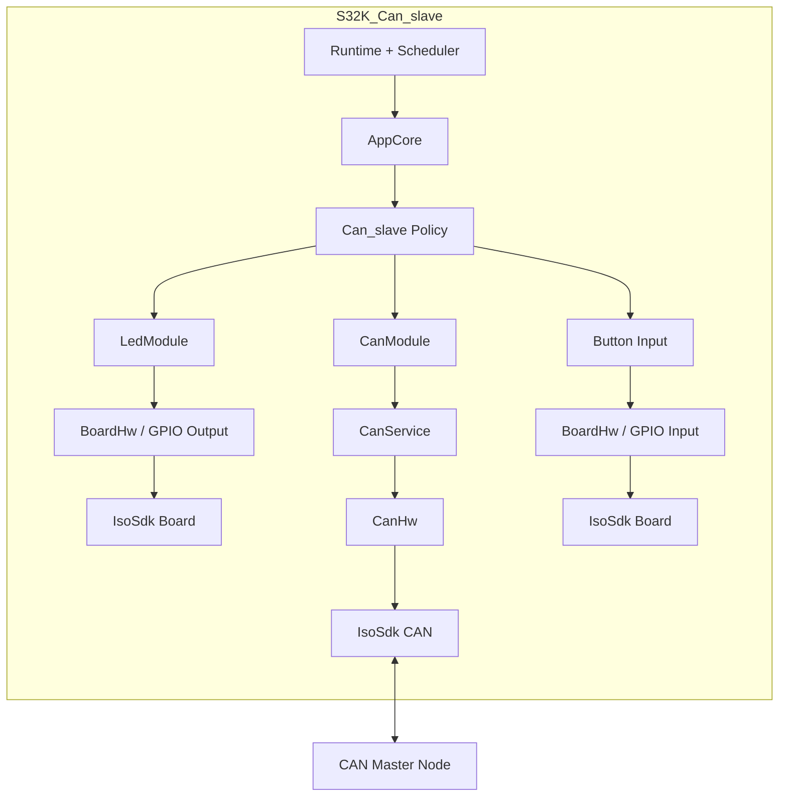

이 구조는 `AppCore` 가 모든 것을 직접 하드웨어로 만지는 방식이 아니라,

- `Runtime` 는 **언제 task를 돌릴지**
- `AppCore` 는 **전체 app 조립과 CAN 진입점**
- `AppSlave1` 은 **slave1 역할 정책**
- `CanModule/CanService` 는 **CAN 요청/응답 추적과 queue 처리**
- `CanHw` 는 **실제 FlexCAN mailbox**
- `Button Input / LedModule / BoardHw` 는 **로컬 입출력**

으로 역할을 나눈 형태다.

---

## 3. 디렉터리 기준 구조

```text
main.c
app/
  app_config.h            // node id, task 주기, timeout, ACK blink 상수
  app_core.*              // 앱 중심 조립점, task entry, 진단/문자열 상태
  app_core_internal.h     // AppCore 내부 상태 layout
  app_port.*              // board 쪽 LED/버튼 접근 포트
  app_slave1.*            // slave1 역할 정책 (command 해석, 버튼, LED)
core/
  can_types.h             // CAN 공통 타입/상수/queue 크기/프로토콜 ID
  infra_queue.*           // 고정 크기 ring queue
  infra_types.h           // 공통 상태코드, wrap-safe 시간 유틸
  runtime_task.*          // cooperative periodic scheduler
  runtime_tick.*          // system tick + ISR hook
drivers/
  board_hw.*              // 보드 자원 adapter
  can_hw.*                // FlexCAN raw TX/RX wrapper
  can_hw_internal.h       // CanHw concrete 저장소
  led_module.*            // LED 의미 패턴 -> GPIO 출력
  tick_hw.*               // tick HW adapter
platform/
  generated/README.md     // generated 입력물 필요 사항 정리
  s32k_sdk/
    isosdk_board.*        // board / GPIO / 핀 접근 wrapper
    isosdk_can.*          // FlexCAN wrapper
    isosdk_tick.*         // LPTMR tick wrapper
    isosdk_uart.*         // 공용 SDK wrapper 자리
    isosdk_lin.*          // 공용 SDK wrapper 자리
    isosdk_board_profile.h // 버튼/LED/LIN XCVR 배선 정보
runtime/
  runtime.*               // init + task table + super loop
services/
  can_module.*            // app 친화적 CAN 요청 버퍼링 계층
  can_module_internal.h   // module concrete layout
  can_proto.*             // logical message <-> raw frame encode/decode
  can_service.*           // pending request / timeout / incoming/result queue
  can_service_internal.h  // service concrete layout
```

---

## 4. 레이어 관점에서 보면

이 프로젝트는 물리 파일 수보다 **논리 레이어** 로 읽는 편이 구조를 파악하기 쉽다.

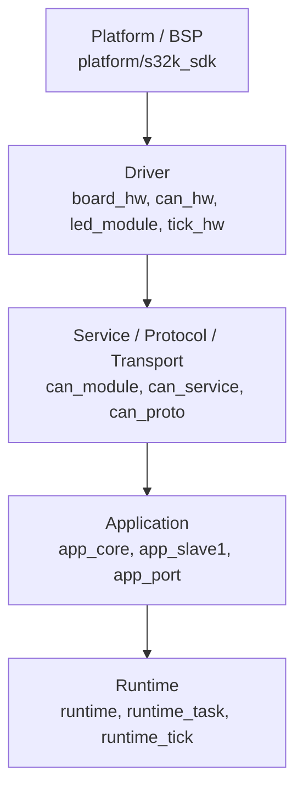

실행 흐름으로 보면 실제 관계는 아래처럼 볼 수 있다.

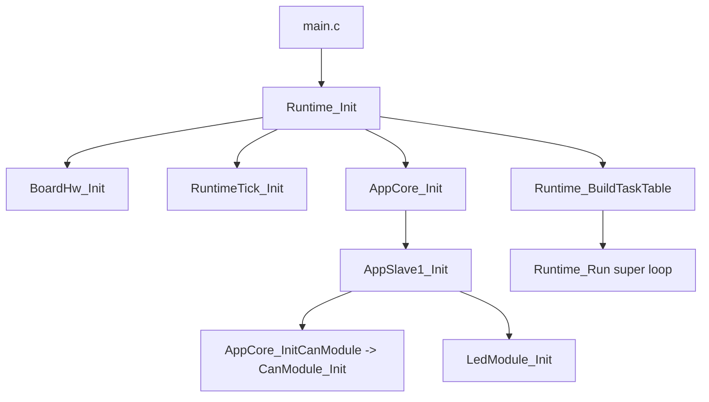

### 레이어별 책임

#### 4.1 `platform/s32k_sdk`
NXP SDK / generated 설정과 직접 맞닿는 층이다. 상위 계층은 `FLEXCAN_DRV_*`, `CLOCK_SYS_*`, `PINS_DRV_*`, `LPTMR_DRV_*` 같은 SDK 이름을 직접 몰라도 된다.

#### 4.2 `drivers`
하드웨어를 조금 더 일반화한 층이다.

- `board_hw`: 버튼/LED 배선을 역할 이름으로 노출
- `can_hw`: mailbox TX/RX, callback bridge, raw RX queue
- `led_module`: 의미 패턴을 pin 출력으로 변환
- `tick_hw`: runtime tick용 HW adapter

#### 4.3 `services`
실제 통신 의미를 갖는 층이다.

- `can_module`: app의 high-level 요청을 queue에 저장
- `can_service`: request ID 추적, response 매칭, timeout 생성
- `can_proto`: 논리 메시지와 raw frame 변환

#### 4.4 `app`
도메인 정책 층이다.

- `app_core`: 조립점 + task entry + 진단 상태 + view text
- `app_slave1`: command를 local slave1 행동으로 해석
- `app_port`: board 자원을 app 의미로 연결

#### 4.5 `runtime/core`
시간 기반 실행 프레임이다.

- `runtime_tick`: 500us base interrupt -> ms timebase
- `runtime_task`: cooperative scheduler
- `runtime`: task table 구성 + super loop

---

## 5. 부팅 / 초기화 순서

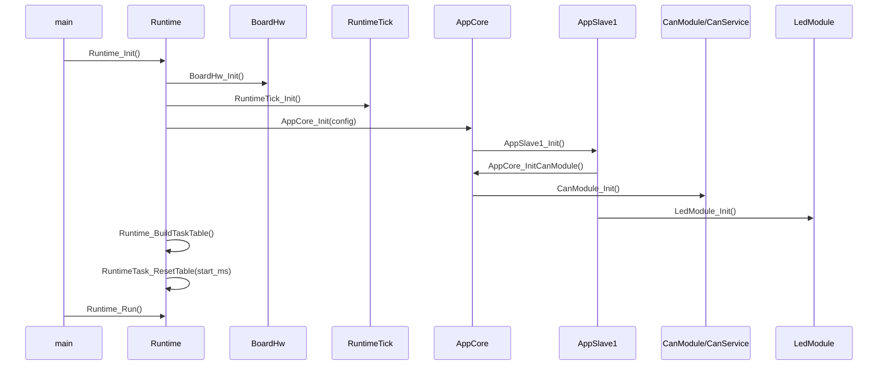

초기화 순서는 아래처럼 진행된다.

1. **보드** 를 먼저 올리고
2. **tick/timebase** 를 만들고
3. **AppCore** 를 초기화한 뒤
4. 내부에서 **slave1 역할(CAN + LED)** 을 올리고
5. 마지막에 **task table** 을 구성한 뒤 super-loop로 들어간다.

현재 코드는 초기화 실패 시 복구 경로나 degraded mode보다는, 초기화가 끝난 뒤 정해진 주기 task를 반복 실행하는 흐름에 가깝다.

---

## 6. 스케줄러 구조

`runtime/runtime.c` 에서 등록되는 task는 네 개다.

| 순서 | task | 주기 |
|---|---|---:|
| 0 | button | 10 ms |
| 1 | can | 10 ms |
| 2 | led | 100 ms |
| 3 | heartbeat | 1000 ms |

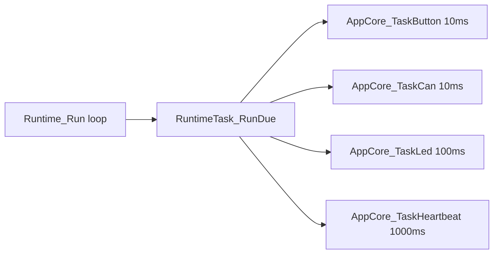

### 이 스케줄링이 의미하는 것

- **버튼 debounce** 는 10ms granularity
- **CAN queue 제출 / 결과 소비 / 수신 처리** 도 10ms granularity
- **ACK blink** 는 100ms tick에 의존
- **alive 표시** 는 heartbeat count 증가만 담당

즉, RTOS 없이 cooperative task 주기로 버튼, CAN, LED, heartbeat를 분리한 구성이다.

---

## 7. 시간축과 tick 구조

`RuntimeTick` 은 LPTMR base interrupt를 받아 millisecond 시간으로 변환한다.

- ISR base period: `RUNTIME_TICK_ISR_PERIOD_US`
- 내부 누적: `g_runtime_tick_us_accumulator`
- 공용 시각: `g_runtime_tick_ms`

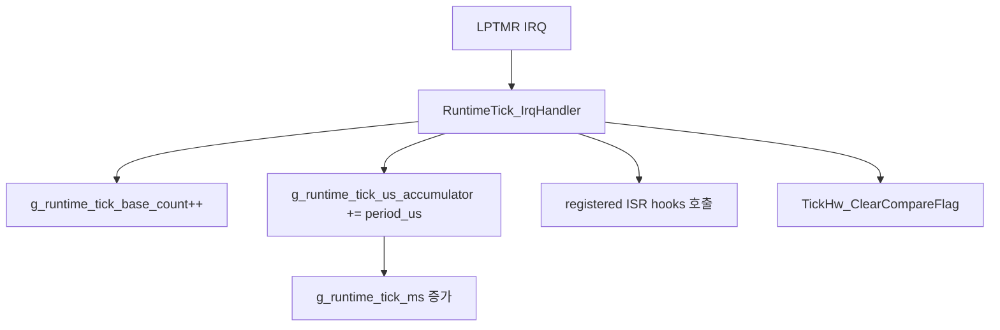

현재 이 slave 프로젝트는 tick hook를 적극적으로 쓰지는 않지만, tick hook를 추가할 수 있는 구조는 갖고 있다.

---

## 8. AppCore가 실질적인 조립점이다

`AppCore` 는 단순 controller라기보다,
**상태 저장소 + CAN 중심 조립점 + task dispatcher + 진단 버퍼** 역할을 동시에 가진다.

### AppCore가 들고 있는 핵심 상태

- 공용 상태
  - `initialized`
  - `local_node_id`
  - `can_enabled`
  - `heartbeat_count`
- slave1 상태
  - `slave1_led_enabled`
  - `slave1_mode`
  - `slave1_ok_request_state`
- 버튼 debounce 상태
  - `button_last_sample_pressed`
  - `button_stable_pressed`
  - `button_same_sample_count`
- CAN 설정/모듈
  - `can_default_timeout_ms`
  - `can_max_submit_per_tick`
  - `CanModule can_module`
- LED 모듈
  - `LedModule slave1_led`
- 진단 정보
  - `can_response_count`
  - `can_timeout_count`
  - `can_send_fail_count`
  - `last_can_result_kind`
  - `last_can_result_code`
  - `last_can_detail_code`
  - `last_can_command_code`
- 표시용 텍스트
  - `mode_text`
  - `button_text`
  - `can_input_text`

즉, UART UI는 없지만 **사람이 읽을 수 있는 짧은 상태 문자열** 을 내부적으로 계속 유지하는 구조다.

---

## 9. slave1 정책의 핵심

`AppSlave1` 이 이 프로젝트의 도메인 로직 중심이다.

### slave1 mode

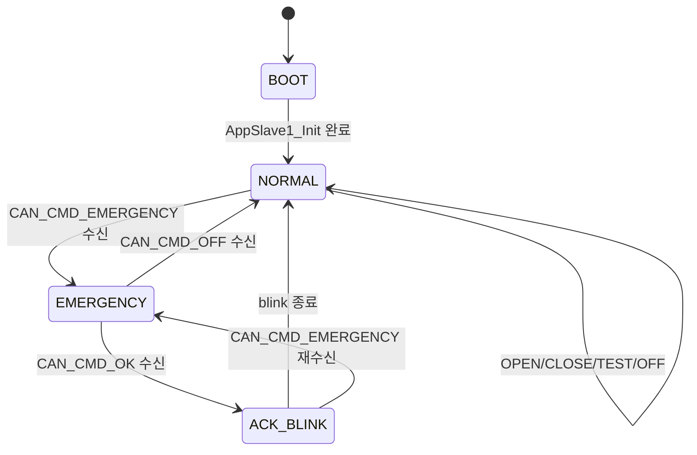

### mode 의미

- `BOOT`: app 초기화 직후 상태
- `NORMAL`: 대기 상태
- `EMERGENCY`: 빨간 LED 고정, 버튼으로 승인 요청 가능
- `ACK_BLINK`: 초록 LED 유한 blink 후 다시 NORMAL 복귀

---

## 10. CAN command를 slave1 동작으로 바꾸는 흐름

`AppSlave1_HandleCanCommand()` 는 master가 보낸 command를 로컬 동작으로 바꾼다.

### 처리되는 주요 command

| command | slave1 반응 |
|---|---|
| `CAN_CMD_EMERGENCY` | mode=`EMERGENCY`, 빨강 LED 고정, 버튼 문구=`press ok` |
| `CAN_CMD_OK` | mode=`ACK_BLINK`, 초록 ACK blink 시작, 버튼 문구=`approved` |
| `CAN_CMD_OFF` | mode=`NORMAL`, LED off, 상태 문구 초기화 |
| `CAN_CMD_OPEN` | 현재는 실제 하드웨어 동작 없이 입력 문구만 갱신 |
| `CAN_CMD_CLOSE` | 현재는 실제 하드웨어 동작 없이 입력 문구만 갱신 |
| `CAN_CMD_TEST` | 현재는 실제 하드웨어 동작 없이 입력 문구만 갱신 |

`OPEN/CLOSE/TEST` 는 이름상 제어 명령이지만, 현재 코드 기준으로는 **placeholder 성격** 이 강하다.

---

## 11. 버튼 입력 처리 흐름

버튼 입력은 즉시 CAN으로 나가지 않는다. 먼저 debounce를 통과한 뒤, `AppCore` 에 **OK 요청 예약 상태** 를 남기고, 실제 CAN queue 제출은 다음 CAN task에서 수행한다.

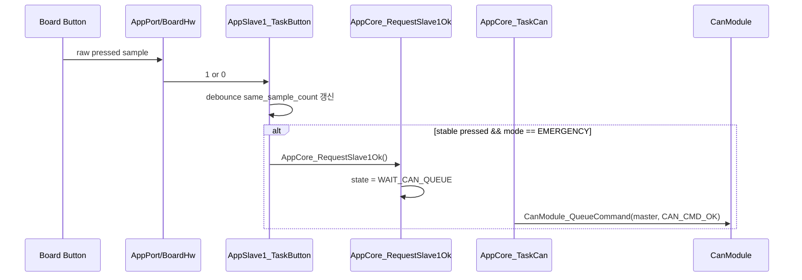

### debounce 방식

- task 주기: `10 ms`
- 연속 동일 샘플 횟수 카운트
- `button_same_sample_count >= 2` 수준에서 stable 판정

실제 체감은 대략 **20~30ms 수준의 간단 debounce** 다.

### 중요한 정책 포인트

- 버튼 입력은 **EMERGENCY mode일 때만** 의미가 있다.
- stable pressed가 되어도 **즉시 송신이 아니라 pending 상태** 로 한 번 저장된다.
- queue가 가득 찼다면 `ok req pending` 상태를 유지하고 다음 tick을 기다린다.

---

## 12. LED 동작 구조

`LedModule` 은 의미 기반 패턴을 실제 GPIO 출력으로 바꾸는 얇은 상태기계다.

### 지원 패턴

- `LED_PATTERN_OFF`
- `LED_PATTERN_GREEN_SOLID`
- `LED_PATTERN_RED_SOLID`
- `LED_PATTERN_YELLOW_SOLID`
- `LED_PATTERN_RED_BLINK`
- `LED_PATTERN_GREEN_BLINK`

### 실제 slave1에서 쓰는 패턴

- emergency: `RED_SOLID`
- ack: `GREEN_BLINK` (finite blink)
- normal/off: `OFF`

### ACK blink 흐름

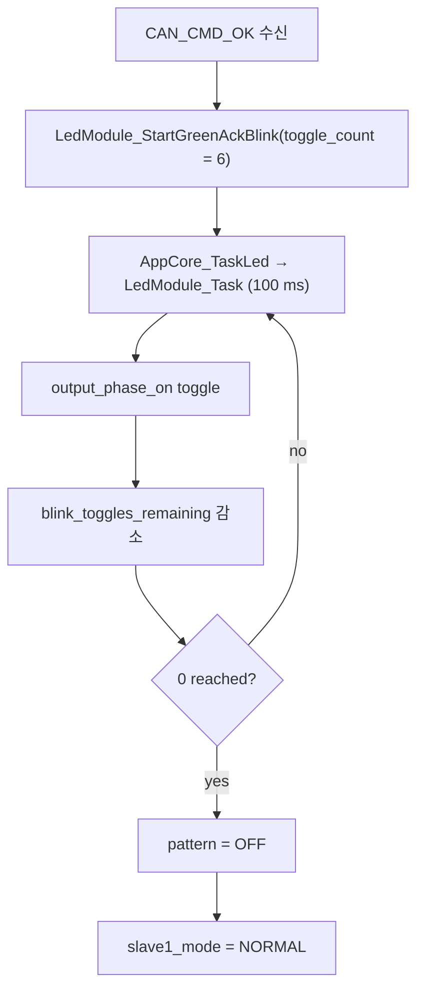

`APP_SLAVE1_ACK_TOGGLES = 6` 은 blink 횟수라기보다 토글 횟수에 가깝다. 체감상으로는 대략 **짧은 3회 수준의 승인 점멸** 이다.

---

## 13. CAN 구조 상세

CAN 쪽은 3단으로 보면 가장 잘 보인다.

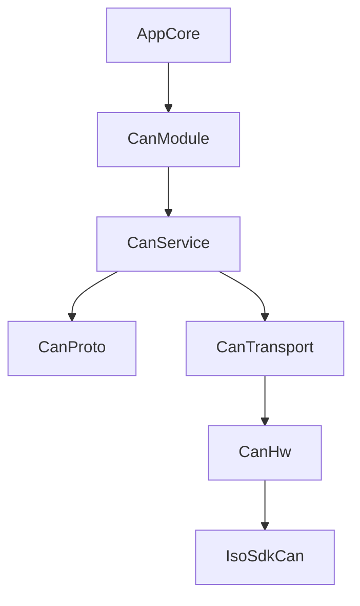

### 13.1 `CanModule`
앱 친화적 queue 계층이다.

- App은 `QueueCommand/QueueResponse/QueueEvent/QueueText` 만 호출
- module은 request를 `request_queue` 에 넣음
- task tick에서 `CanService_*` 로 점진 제출
- tick당 제출량은 `max_submit_per_tick` 으로 제한

즉, app은 transport/hardware 세부사항보다 **의도 표현** 에 집중한다.

### 13.2 `CanService`
실제 핵심이다.

역할:

- request ID 발급
- pending request table 관리
- response 매칭
- timeout 결과 생성
- incoming queue / result queue 분리
- protocol/transport 연결

### 13.3 `CanProto`
논리 메시지와 raw frame 변환 담당이다.

- message type -> std ID 매핑
- frame validation
- text payload printable ASCII 검증
- 1-frame encode/decode

### 13.4 `CanTransport`
software TX/RX queue + in-flight TX 관리 계층이다.

- TX queue front peek 후 start
- TX 완료/실패 시 front 제거
- HW RX -> SW RX queue 흡수
- HW busy / result 정리

### 13.5 `CanHw`
실제 FlexCAN mailbox wrapper다.

- controller init
- TX MB / RX MB 설정
- accept-all RX mask
- RX callback -> raw frame queue 적재
- TX callback -> TX result 기록

---

## 14. CAN protocol 요약

### 공통 설정

- version: `CAN_PROTO_VERSION_V1 = 1`
- node id 범위: `1 ~ 254`
- broadcast: `255`
- frame payload buffer size: `16`
- text max len: `11`

### standard ID 매핑

| message type | std ID |
|---|---:|
| `CAN_MSG_COMMAND` | `0x120` |
| `CAN_MSG_RESPONSE` | `0x121` |
| `CAN_MSG_EVENT` | `0x122` |
| `CAN_MSG_TEXT` | `0x123` |

### 일반 메시지(frame dlc=8)

| byte | 의미 |
|---:|---|
| 0 | version |
| 1 | source_node_id |
| 2 | target_node_id |
| 3 | request_id |
| 4 | payload[0] |
| 5 | payload[1] |
| 6 | payload[2] |
| 7 | flags |

### text 메시지

| byte | 의미 |
|---:|---|
| 0 | version |
| 1 | source_node_id |
| 2 | target_node_id |
| 3 | text_type |
| 4 | text_length |
| 5.. | ASCII text |

### text 제약

- printable ASCII only
- 길이 `1 ~ 11`
- single frame only

---

## 15. CAN 송신 흐름

### 15.1 app -> CAN 제출

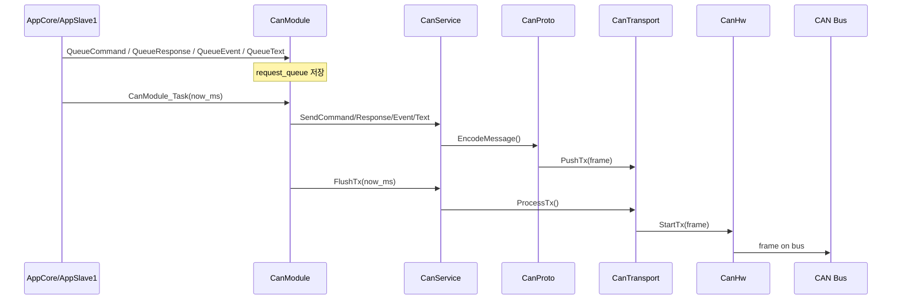

### 15.2 need_response가 있는 command

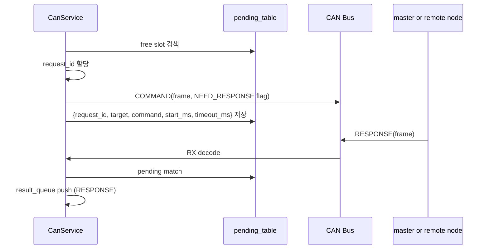

response를 기대하는 송신은 **단순 send만 하는 것이 아니라 pending table도 함께 연다** 는 점이 핵심이다.

---

## 16. CAN 수신 흐름

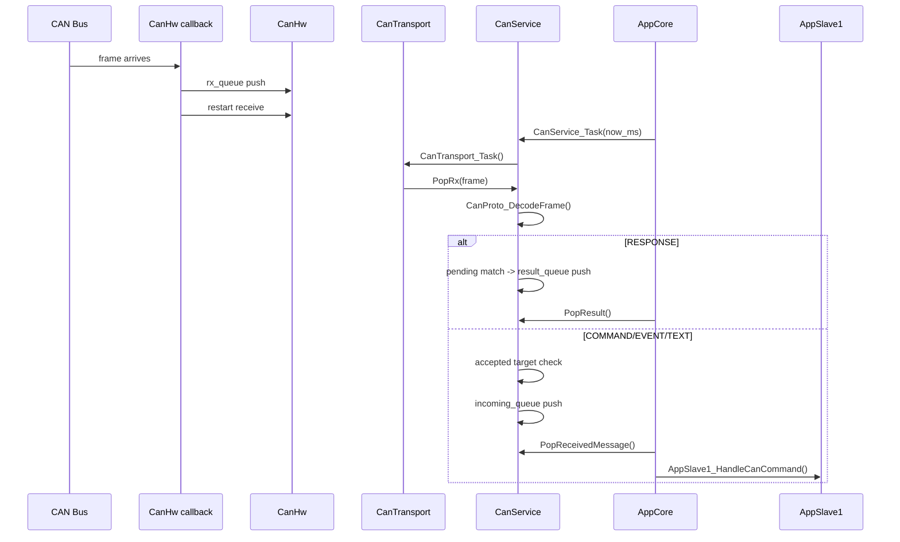

### 현재 app 수준에서 실제로 처리하는 수신 타입

실제로 `AppCore_ProcessIncomingCanCommand()` 는 `message_type == CAN_MSG_COMMAND` 만 의미 있게 다룬다. 구조상 event/text를 받을 수는 있지만, **현재 app 로직은 command 중심** 이다.

---

## 17. result queue 와 incoming queue 가 분리된 이유

`CanService` 는 수신된 데이터를 두 방향으로 나눈다.

### `incoming_queue`
- COMMAND
- EVENT
- TEXT

즉, app가 직접 의미 해석해야 하는 메시지들이다.

### `result_queue`
- RESPONSE 매칭 결과
- TIMEOUT 합성 결과
- SEND_FAIL 류 결과

즉, request lifecycle 결과를 app가 읽는 통로다.

이 구조에서는

- “들어온 메시지” 와
- “내가 전에 보낸 요청의 완료 상태”

를 다른 채널로 읽게 된다.

---

## 18. timeout 처리 구조

`CanService_ProcessTimeouts()` 는 pending table 전체를 순회하며 timeout을 검사한다.

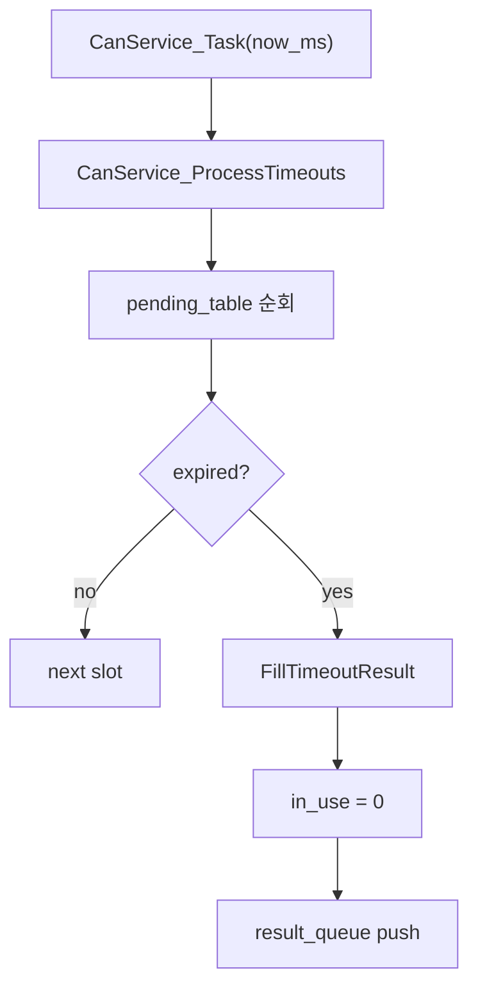

중요한 점:

- timeout 판정은 `Infra_TimeIsExpired(now_ms, start_ms, timeout_ms)` 로 wrap-safe 하게 계산된다.
- app 입장에서는 실제 response가 없더라도 **동일한 `CanServiceResult` 구조** 로 timeout을 받을 수 있다.

즉, 상위에서는 response / timeout을 같은 종류의 완료 이벤트처럼 다룰 수 있다.

---

## 19. CanTransport의 의미

이 프로젝트에서 transport는 별도 파일이 아니라 `can_service.c` 내부 구현으로 존재하지만, 논리적으로는 한 레이어로 구분해서 볼 수 있다.

### transport가 하는 일

- HW RX queue -> SW RX queue 배수
- TX queue front peek
- HW TX 시작
- TX 완료/실패 결과 반영
- `tx_in_flight` 상태 유지

즉, transport는 **protocol을 모르고 frame만 다루는 중간층** 이다.

### 제약 포인트

- queue full 시 drop/실패 전략이 단순함
- retry/backoff 같은 복구 정책은 거의 없음

---

## 20. CanHw와 platform binding

`CanHw` 는 `IsoSdk_Can*` wrapper 위에 올라간다.

### 기본 mailbox 설정

- TX mailbox index: `1`
- RX mailbox index: `0`
- RX mask: accept-all

### low-level 특성

- `CAN_FRAME_DATA_SIZE = 16`
- `IsoSdk_CanInitDataInfo()` 에서 `fd_enable = true`, `enable_brs = true`

즉, 이 코드는 상위 protocol은 단순 1-frame 구조지만, low-level 설정은 **CAN FD + BRS 사용을 전제** 로 잡고 있다. 이 부분은 시스템 전체 버스 구성과 맞아야 한다.

---

## 21. 버튼 승인 요청 경로의 실제 의미

이 프로젝트에서 가장 실질적인 local -> remote 제어는 버튼 기반 승인 요청이다.

### 흐름

1. master가 `CAN_CMD_EMERGENCY` 를 slave1에게 보냄
2. slave1은 빨간 LED를 켜고 emergency mode로 들어감
3. 사용자가 버튼을 누름
4. debounce를 통과하면 `AppCore_RequestSlave1Ok()` 호출
5. 상태는 `WAIT_CAN_QUEUE` 로 바뀜
6. 다음 `AppCore_TaskCan()` 에서 master로 `CAN_CMD_OK` 를 queue 제출

즉, slave1은 **button press를 즉시 로컬 action으로 끝내지 않고, remote approval request로 바꾼다.**

---

## 22. AppCore_TaskCan() 이 실제로 하는 일

이 함수는 CAN 관련 모든 주기 작업을 한 번에 묶는다.

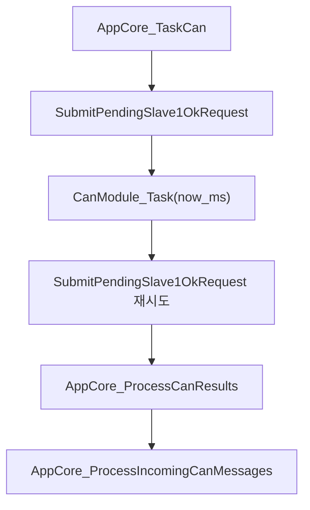

이 함수 안에서는

- task 시작 전에 pending OK 요청을 먼저 queue 넣어 보고
- CAN service/transport를 한 번 진행한 뒤
- queue 여유가 생겼을 수 있으니 한 번 더 pending OK를 제출해 보고
- 그다음 result와 incoming을 app가 소비한다

는 순서로 동작한다.

즉, `AppCore_TaskCan()` 은 단순 wrapper가 아니라 **submit + transport progress + consume** 를 한 함수 안에서 묶어 수행한다.

---

## 23. 진단 상태는 있지만 출력 경로는 약하다

이 프로젝트는 내부적으로 진단 정보를 꽤 들고 있다.

### AppCore diag

- response count
- timeout count
- send fail count
- last result kind/code/detail/command

하지만 현재 구조상 이 값들을 사람이 바로 보는 UART/로그 경로는 없다. 즉,

- 내부 상태는 있음
- 외부 관찰 수단은 약함

이라는 특징이 있다.

---

## 24. build 관점에서 주의할 점

`platform/generated/README.md` 를 보면 이 압축본은 **정리된 소스 구조본** 이고, standalone 완전 빌드 패키지는 아니다.

필요한 항목:

- `sdk_project_config.h`
- 필요 시 `sdk_project_config.c`
- SDK 기본 헤더 include path
  - `status.h`
  - `device_registers.h`
  - `osif.h`
  - `callbacks.h`

즉, 이 zip만으로 구조 분석은 충분하지만, **바로 재빌드 가능하다고 단정하면 안 된다.**

---

## 25. 현재 구조의 한계 / 주의 포인트

### 25.1 `OPEN/CLOSE/TEST` 는 아직 실동작이 없다
응답은 `CAN_RES_OK` 를 줄 수 있지만, 실제 하드웨어 반응은 거의 없다.

### 25.2 버튼으로 보내는 OK 요청은 fire-and-forget에 가깝다
`AppCore_SubmitPendingSlave1OkRequest()` 는 `CanModule_QueueCommand(... need_response=0)` 로 보낸다.
즉,

- master 응답을 기다리지 않음
- pending table에 추적하지 않음
- timeout 결과도 생기지 않음

승인 요청의 신뢰성 추적은 약한 편이다.

### 25.3 fault loop가 매우 단순하다
초기화 실패 시 그냥 무한 루프다. 왜 실패했는지 외부에서 알기 어렵다.

### 25.4 event/text는 구조상 지원하지만 app는 거의 command 중심이다
현재 slave1 정책은 사실상 command만 실질 처리한다.

### 25.5 transport 혼잡 시 복구 정책이 단순하다
queue full / hw tx fail에 대해 drop 쪽 성격이 강하고, retry/backoff는 약하다.

### 25.6 idle sleep이 없다
`Runtime_Run()` 은 계속 super-loop를 돈다. 저전력 구조는 아니다.

### 25.7 low-level은 CAN FD+BRS 전제를 가진다
상위 protocol은 단순하지만, bus/system 설정과 맞지 않으면 실제 운용 시 문제가 될 수 있다.

---

## 26. 파일별 핵심 책임

### `main.c`
- 프로그램 시작점
- runtime init/run 호출만 담당

### `runtime/runtime.c`
- board/tick/app 초기화
- task table 구성
- super-loop 실행

### `core/runtime_tick.c`
- LPTMR 기반 ms timebase 제공
- ISR hook table 관리

### `core/runtime_task.c`
- due task만 실행하는 cooperative scheduler

### `app/app_core.c`
- app 중심 조립점
- CAN result/incoming 처리
- pending OK 요청 제출
- task entry 제공
- mode/button/can text 유지

### `app/app_slave1.c`
- CAN command -> slave1 local behavior
- 버튼 debounce
- ACK blink 종료 후 mode 복귀

### `app/app_port.c`
- board LED/button 자원을 app 의미로 연결

### `services/can_module.c`
- app 요청을 내부 queue에 적재
- tick당 제한된 수만큼 service로 전달

### `services/can_service.c`
- pending request/response/timeout 핵심
- incoming/result queue 분리
- transport 포함

### `services/can_proto.c`
- logical message <-> raw frame 변환

### `drivers/can_hw.c`
- FlexCAN mailbox start/restart/result 처리
- raw RX queue 보관

### `drivers/led_module.c`
- 의미 패턴을 실제 GPIO 출력으로 변환
- finite blink 진행

### `drivers/board_hw.c`
- 보드 init
- LED config / button read 제공

### `platform/s32k_sdk/isosdk_*`
- NXP SDK binding layer
- generated 설정과 상위 레이어 사이의 접점

---

## 27. 이 프로젝트를 이해할 때 가장 중요한 포인트

### 포인트 1: 이건 “간단한 CAN slave 앱”이다
LIN/UART UI/BLE 같은 다기능 coordinator가 아니라, **master 명령에 반응하는 현장 노드** 에 초점이 맞춰져 있다.

### 포인트 2: 실질 중심은 `AppCore + AppSlave1`
- `AppCore` = 조립 / task / 진단 / CAN 진입점
- `AppSlave1` = slave1 정책

### 포인트 3: 버튼 입력은 직접 action이 아니라 remote 요청이다
로컬 버튼을 눌렀다고 끝나는 게 아니라, master로 `OK` command를 다시 보내는 구조다.

### 포인트 4: CAN은 “message”와 “request result”를 분리해서 다룬다
incoming queue와 result queue 분리가 이 구조의 핵심이다.

### 포인트 5: 현재 코드는 데모/bring-up용 최소 구조에 가깝다
설계는 정리돼 있지만, fault visibility와 신뢰성 추적은 아직 제한적이다.

---

## 28. 추천 읽는 순서

처음 보는 사람이면 아래 순서가 가장 자연스럽다.

1. `main.c`
2. `runtime/runtime.c`
3. `app/app_core.h`, `app/app_core_internal.h`, `app/app_core.c`
4. `app/app_slave1.c`
5. `services/can_module.h`, `services/can_module.c`
6. `services/can_service.h`, `services/can_service.c`
7. `services/can_proto.c`
8. `drivers/can_hw.c`
9. `drivers/led_module.c`, `drivers/board_hw.c`
10. `platform/s32k_sdk/*`

이 순서로 보면 **정책 -> 통신 의미 -> 하드웨어** 방향으로 내려가며 볼 수 있다.

---

## 29. 최종 정리

이 프로젝트는 전체적으로 보면

- **얇은 main**
- **runtime 기반 cooperative scheduler**
- **AppCore 중심 조립 구조**
- **AppSlave1 중심 slave 정책**
- **CAN request/response service**
- **버튼 -> 승인 요청** 흐름
- **LED 패턴 상태기계**

로 구성된다.

현재 구조를 읽을 때는 아래 연결을 중심으로 보면 된다.

- `main / runtime` : 시스템 시작과 주기 실행
- `app_core / app_slave1` : 버튼, mode, command 해석
- `can_module / can_service / can_proto` : 요청, 응답, timeout, 프레임 처리
- `led_module / board_hw / can_hw` : 실제 LED, 버튼, CAN HW 연결

추가 수정 지점은 주로

- `OK` 요청의 응답 추적 여부
- `OPEN/CLOSE/TEST` 의 실제 동작 정의
- fault 표시 경로
- 진단 정보의 외부 노출
- transport 혼잡 시 복구 정책

쪽에서 나올 가능성이 크다.

---

## 30. 한 장 요약 다이어그램

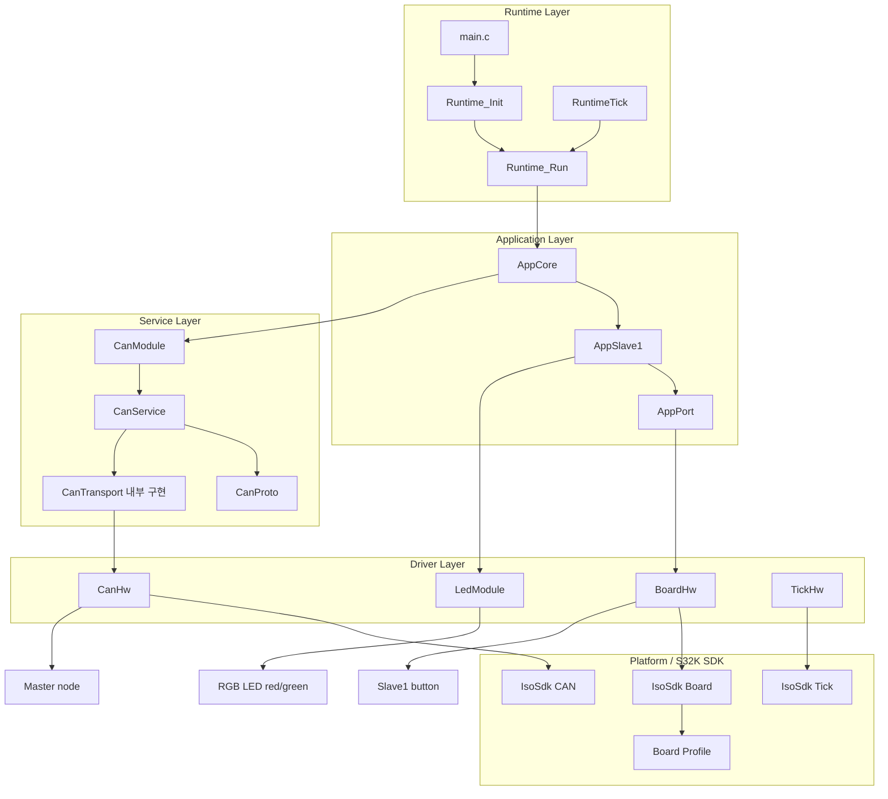
