# S32K_Lin_slave 구조/레이어/데이터 흐름 상세 정리

분석 대상: 업로드된 `S32K_Lin_slave.zip`

---

## 1. 프로젝트 한 문장 요약

이 프로젝트는 **S32K 보드 위에서 동작하는 LIN sensor slave 노드**이며,

- **ADC** 로 아날로그 값을 주기적으로 읽고
- 값을 **SAFE / WARNING / DANGER / EMERGENCY** 구간으로 해석하며
- 한 번 emergency에 들어가면 **latch** 를 유지하고
- **LIN slave** 로서 master의 `status PID` 요청에 현재 센서 상태를 응답하고
- master의 `OK token PID` 요청이 들어오면 조건이 맞을 때만 latch를 해제하며
- 현재 상태를 **RGB LED** 로 시각화하는 구조다.

즉, 이 프로젝트는
**“센서 상태 생성 + LIN 상태 응답 + 승인 token 기반 latch 해제 + LED 표시”** 를 묶은 **센서 상태 응답 노드**로 볼 수 있다.

---

## 2. 최상위 구조 요약

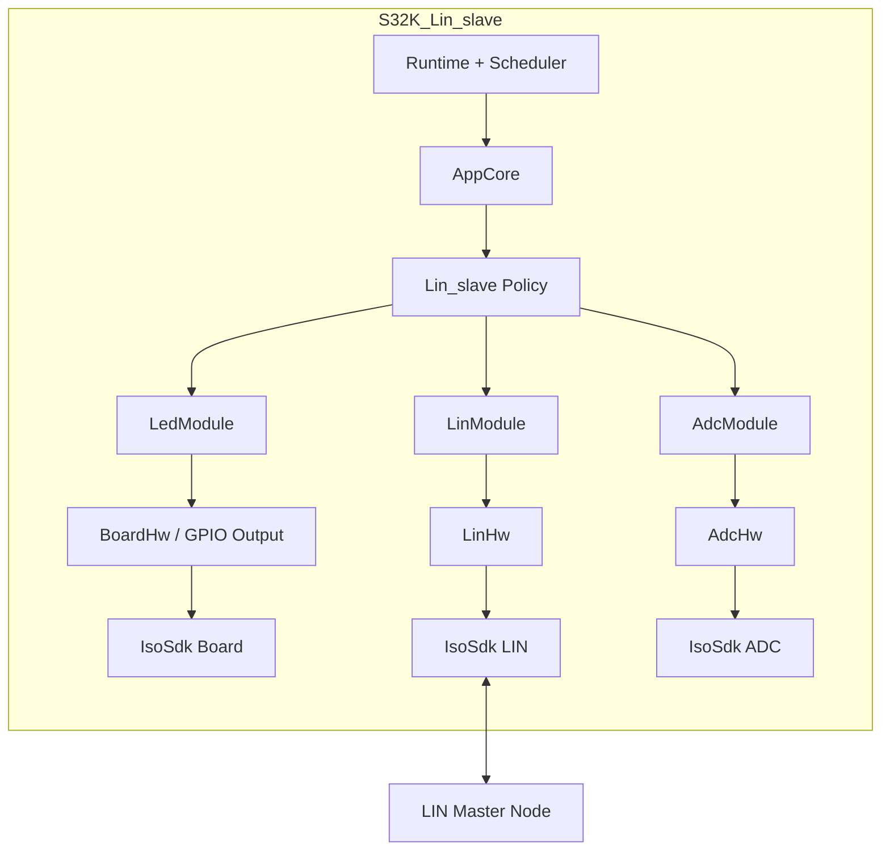

핵심 흐름은 `AppCore` 가 직접 하드웨어를 다루는 것이 아니라,

- `AppSlave2` 는 정책 연결 계층
- `AdcModule` 은 센서 해석 계층
- `LinModule` 은 LIN 상태기계 계층
- `LedModule` 은 로컬 표시 계층
- `Runtime` 는 실행 스케줄 계층

으로 나뉘어 있다는 점이다.

---

## 3. 디렉터리 기준 구조

```text
main.c
app/
  app_config.h            // node id, task period
  app_core.*              // 앱 전체 조립점, task entry
  app_core_internal.h     // AppCore 내부 상태 구조체
  app_slave2.*            // slave2 정책 로직
core/
  infra_queue.*           // 공용 ring queue (현재 slave에서는 비중 낮음)
  infra_types.h           // 공통 status/time 유틸
  runtime_task.*          // cooperative periodic scheduler
  runtime_tick.*          // system tick + ISR hook
drivers/
  adc_hw.*                // ADC raw binding
  board_hw.*              // 보드 자원 초기화 / LED config / LIN transceiver
  led_module.*            // LED pattern module
  lin_hw.*                // LIN HW adapter
  tick_hw.*               // tick HW adapter
platform/s32k_sdk/
  isosdk_adc.*            // NXP SDK ADC binding
  isosdk_board.*          // board binding
  isosdk_lin.*            // NXP SDK LIN binding
  isosdk_tick.*           // tick binding
  isosdk_can.*            // 공용 레이어 흔적이지만 이 프로젝트 핵심 흐름에선 미사용
  isosdk_uart.*           // 공용 레이어 흔적이지만 이 프로젝트 핵심 흐름에선 미사용
runtime/
  runtime.*               // init + super loop
  runtime_io.*            // role-specific binding (slave2 ADC/LIN/LED config)
services/
  adc_module.*            // ADC sampling + zone/latch policy
  adc_module_internal.h   // 내부 sample state
  lin_module.*            // LIN 공용 상태기계
  lin_module_internal.h   // 내부 event/state 구조
```

---

## 4. 레이어 관점 정리

이 프로젝트는 물리 파일 수보다 논리 레이어 기준으로 보면 흐름이 더 잘 보인다.

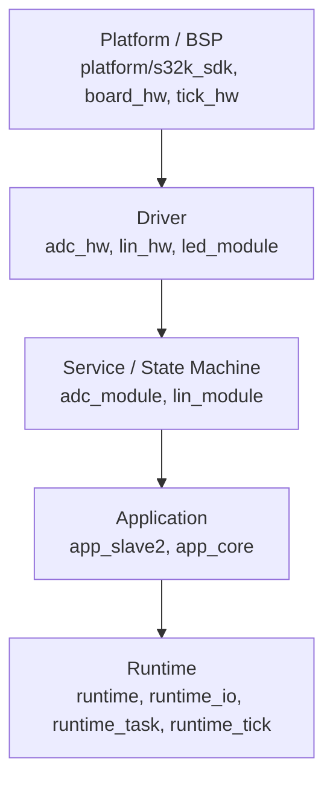

흐름 기준으로 보면 아래처럼 읽을 수 있다.

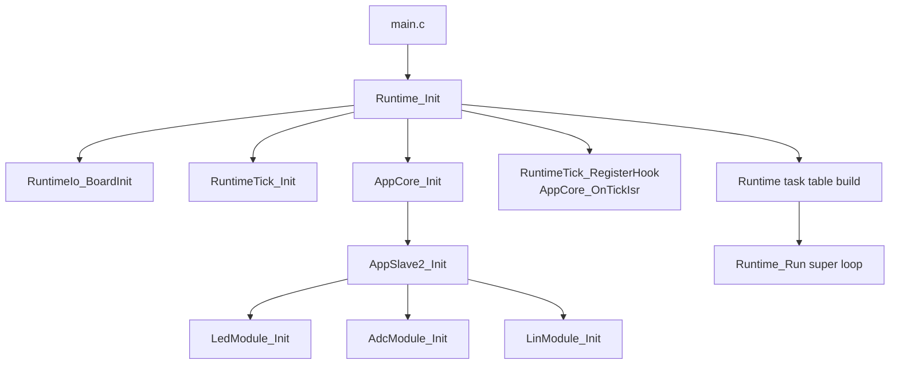

### 4.1 `platform/s32k_sdk`
벤더 SDK / generated 코드와 직접 맞닿는 층이다.
`IsoSdk_*` 이름으로 감싸 두었기 때문에 상위 계층이 SDK 구조체와 symbol을 직접 알지 않아도 된다.

### 4.2 `drivers`
하드웨어를 조금 더 일반화한 층이다.

- `adc_hw` 는 ADC init/sample binding
- `lin_hw` 는 LIN init/header/send/receive/timeout binding
- `led_module` 은 GPIO 기반 LED pattern 표시
- `board_hw` 는 보드 초기화와 핀 구성

을 담당한다.

### 4.3 `services`
의미 있는 상태/통신 계층이다.

- `adc_module`: raw ADC → semantic zone + latch
- `lin_module`: LIN wire format + event state machine

### 4.4 `app`
실제 동작 정책을 연결하는 층이다.

- `app_slave2`: ADC 상태를 LIN status/LED에 반영
- `app_core`: task entry, 문자열 상태, 모듈 조립

### 4.5 `runtime/core`
전체 시스템의 시간 기반 실행 프레임이다.

- `runtime_tick`: 시간 기준
- `runtime_task`: cooperative scheduler
- `runtime`: task table 구성 + super loop
- `runtime_io`: slave2 역할 전용 binding assembly

---

## 5. 부팅 / 초기화 순서

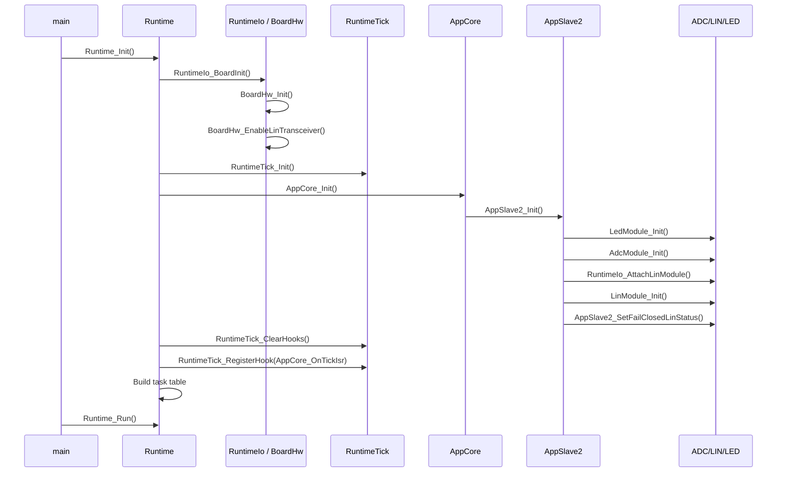

초기화 순서는 다음 순서로 정리할 수 있다.

1. **보드 / 트랜시버** 초기화
2. **tick / timebase** 초기화
3. **AppCore** 초기화 및 slave2 전용 모듈 조립
4. **tick ISR hook** 으로 LIN timeout service 연결
5. **super loop** 진입

---

## 6. 스케줄러 구조

`runtime/runtime.c` 에서 slave2용 task table이 고정 구성된다.

| 순서 | task | 주기 |
|---|---|---:|
| 1 | lin_fast | 1 ms |
| 2 | adc | 20 ms |
| 3 | led | 100 ms |
| 4 | heartbeat | 1000 ms |

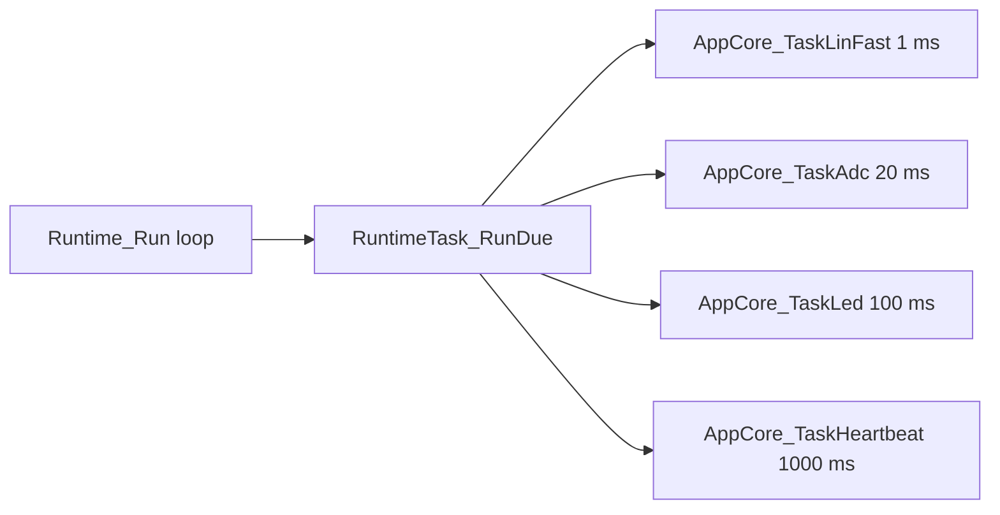

### 6.1 왜 `lin_fast` 만 있고 `lin_poll` 은 없는가

이 프로젝트는 **LIN master가 아니라 LIN slave** 다.
따라서 스스로 버스 transaction을 시작하지 않는다.

즉,

- master 쪽처럼 `poll task` 로 header를 보내는 역할은 없고
- callback에서 적재된 event를 처리하는 `fast task` 중심으로 동작한다.

---

## 7. AppCore가 맡는 역할

`AppCore` 는 이 프로젝트의 중앙 조립점이다.

### 7.1 AppCore가 들고 있는 핵심 상태

- enable 상태
  - `lin_enabled`
  - `adc_enabled`
  - `led2_enabled`
- 시스템 상태
  - `initialized`
  - `local_node_id`
  - `heartbeat_count`
- 서브모듈 인스턴스
  - `LinModule lin_module`
  - `LedModule slave2_led`
  - `AdcModule adc_module`
- 내부 표시 문자열
  - `adc_text`
  - `lin_input_text`
  - `lin_link_text`

즉, `AppCore` 는
**상태 저장소 + 모듈 조립점 + task dispatcher** 역할을 맡고 있다.

---

## 8. 핵심 정책 흐름: ADC → LIN status → LED

이 sensor slave의 핵심 흐름은 아래 한 줄로 요약할 수 있다.

> **ADC 상태를 읽고 해석한 뒤, 그 결과를 LIN status cache와 LED 표시로 동기화한다.**

이를 가장 직접적으로 보여 주는 함수가 `AppSlave2_TaskAdc()` 이다.

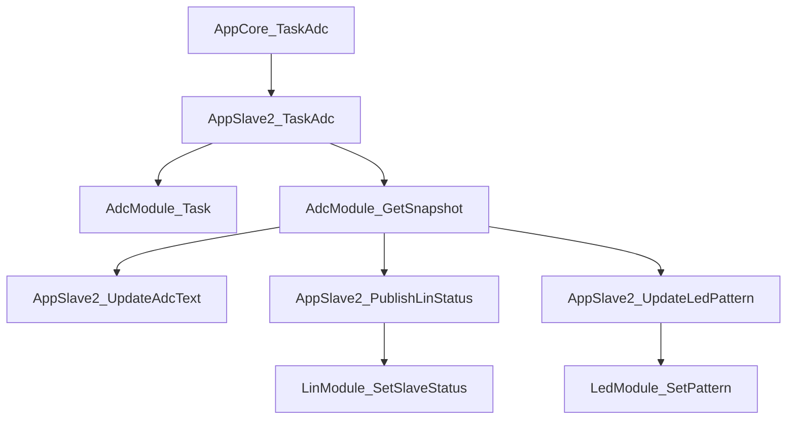

즉 ADC task 하나 안에서,

1. 센서를 읽고
2. 해석 상태를 얻고
3. 내부 표시 문자열을 갱신하고
4. 다음 LIN status 응답용 cache를 갱신하고
5. LED 패턴을 바꾼다.

---

## 9. ADC 구조 상세

### 9.1 `runtime_io` 가 ADC 의미를 조립한다

ADC module은 threshold나 HW callback을 스스로 알지 못한다.
그 설정은 `RuntimeIo_GetSlave2AdcConfig()` 가 한 번에 조립한다.

설정값은 다음과 같다.

- `range_max = 4096`
- `safe_max = 1365`
- `warning_max = 2730`
- `emergency_min = 3413`
- `sample_period_ms = 20`

즉 구간은 대략 아래처럼 해석된다.

```text
0 ~ 1364      -> SAFE
1365 ~ 2729   -> WARNING
2730 ~ 3412   -> DANGER
3413 ~ 4095   -> EMERGENCY
```

### 9.2 `AdcModule` 의 핵심 역할

`AdcModule` 은 다음 역할을 함께 맡는다.

- raw ADC 읽기
- 범위 clamp
- zone 분류
- emergency latch 유지
- sample empty / fault / valid 상태 관리

즉, **센서 해석 상태를 보관하는 모듈** 이다.

### 9.3 ADC 데이터 흐름

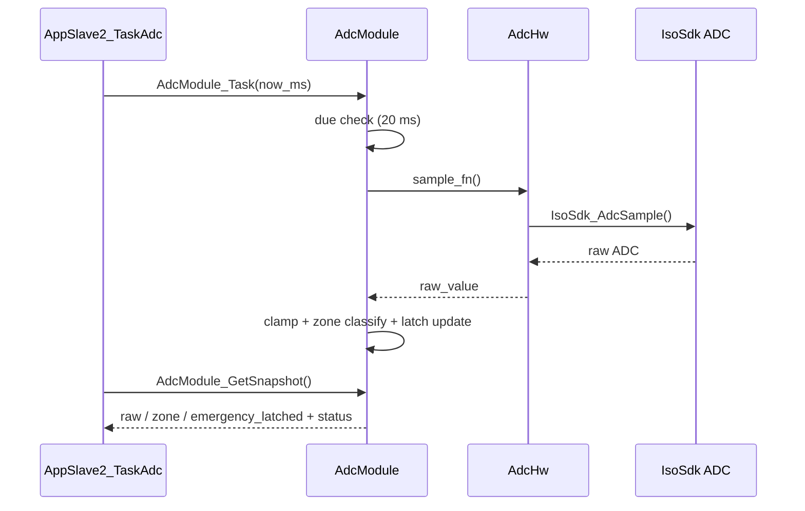

### 9.4 sample 상태 모델

`AdcModule_GetSnapshot()` 은 snapshot과 함께 현재 sample 상태를 `InfraStatus` 로 돌려준다.

- `INFRA_STATUS_EMPTY` : 아직 샘플 없음
- `INFRA_STATUS_OK` : 정상 샘플
- `INFRA_STATUS_IO_ERROR` : 샘플 오류 → fail-closed

이 덕분에 상위 계층은 `waiting`, `fault`, `valid` 를 같은 API로 처리한다.

---

## 10. emergency latch 정책

이 프로젝트의 안전 정책 핵심은 `emergency_latched` 다.

### 10.1 의미

- ADC zone이 한 번 `EMERGENCY` 가 되면 `emergency_latched = 1`
- 이후 ADC 값이 조금 내려와도 자동으로 바로 풀리지 않음
- master가 LIN으로 `OK token` 을 보내더라도,
  **현재 zone이 emergency가 아니어야만** latch 해제 가능

### 10.2 latch 흐름

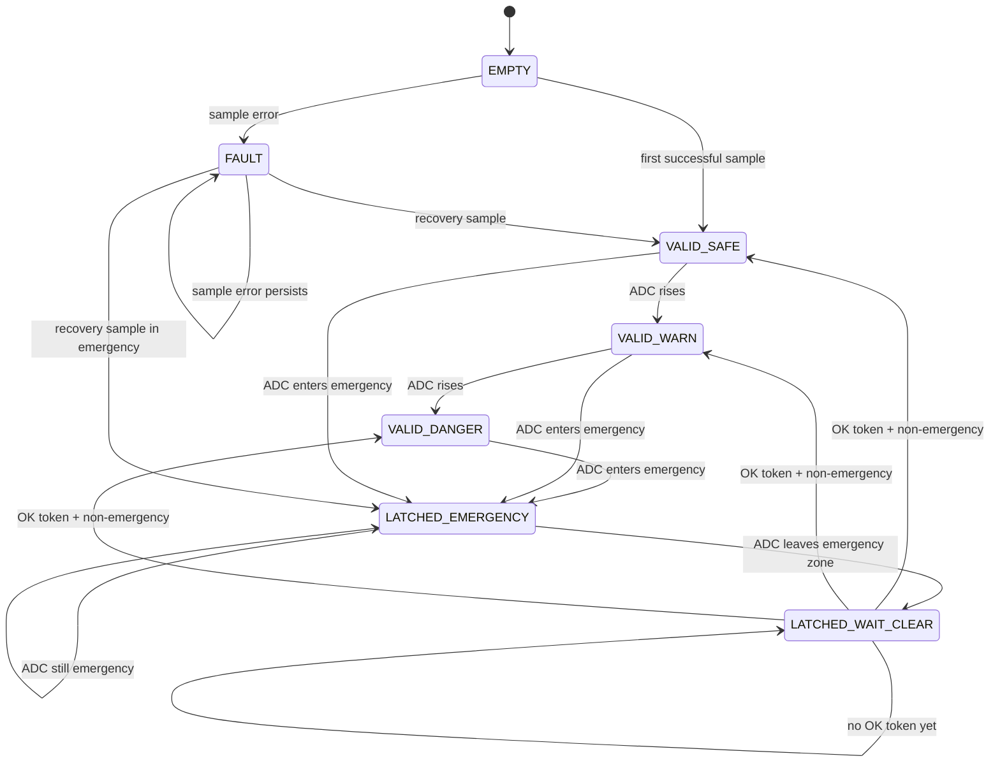

### 10.3 실제 해제 조건

`AdcModule_ClearEmergencyLatch()` 는 아래 경우에만 성공한다.

1. 모듈이 정상 초기화돼 있어야 함
2. sample_state 가 `EMPTY` 가 아니어야 함
3. sample_state 가 `FAULT` 가 아니어야 함
4. 현재 zone이 `EMERGENCY` 가 아니어야 함

즉,
**token을 받았다고 바로 해제되는 구조가 아니라**, 현재 센서 상태를 다시 확인한 뒤 해제 조건을 만족할 때만 latch를 푼다.

---

## 11. fail-closed 정책

이 프로젝트는 초기 상태와 샘플 오류 시 fail-closed 방향으로 동작한다.

### 11.1 부팅 직후

`AppSlave2_SetFailClosedLinStatus()` 는 초기 LIN status cache를 아래처럼 채운다.

- `adc_value = 0`
- `zone = EMERGENCY`
- `emergency_latched = 1`
- `valid = 0`
- `fault = 1`

즉, 실제 센서 샘플을 받기 전까지는 안전 정보가 확정되지 않은 상태로 시작한다.

### 11.2 ADC sample 오류 시

`AdcModule_SetFailClosedSnapshot()` 이 호출되어,

- `raw_value = 0`
- `zone = EMERGENCY`
- `emergency_latched = 1`
- `sample_state = FAULT`

로 강제된다.

### 11.3 의미

센서 오류를 “모름” 상태로 두지 않고,
상위 계층이 위험 상태로 처리할 수 있도록 snapshot을 구성한다.

---

## 12. LIN 구조 상세

LIN 쪽은 **slave 상태기계** 기준으로 보면 흐름이 가장 잘 보인다.

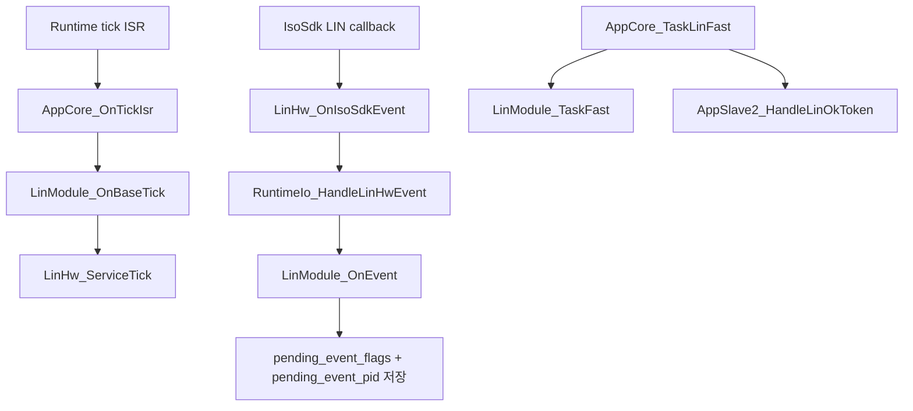

### 12.1 `LinModule` 내부 핵심 상태

- 상태: `IDLE / WAIT_PID / WAIT_RX / WAIT_TX`
- 이벤트 입력:
  - `PID_OK`
  - `RX_DONE`
  - `TX_DONE`
  - `ERROR`
- 버퍼:
  - `rx_buffer[8]`
  - `tx_buffer[8]`
- slave 전송용 cache:
  - `slave_status_cache`
- slave가 수신한 승인 token 표시:
  - `ok_token_pending`

### 12.2 slave 모드 동작

slave는 스스로 transaction을 시작하지 않는다.
master가 보낸 PID에 반응한다.

- `pid_status (0x24)` 가 오면 → 현재 `slave_status_cache` 를 TX payload로 송신
- `pid_ok (0x25)` 가 오면 → 1바이트를 RX 받아 `ok_token` 인지 확인

---

## 13. LIN wire format

### 13.1 status frame payload

`LinModule_PrepareStatusTx()` 기준으로 status payload는 아래처럼 구성된다.

```text
byte0 : adc low
byte1 : adc high (12-bit 상위)
byte2 : zone
byte3 : emergency_latched
byte4 : flags(valid/fresh/fault)
byte5~7 : 현재는 0
```

flag bit는 다음과 같다.

- bit0: `VALID`
- bit1: `FRESH`
- bit2: `FAULT`

### 13.2 PID / token 설정

`runtime/runtime_io.c` 기준 설정은 다음과 같다.

- `pid_status = 0x24`
- `pid_ok = 0x25`
- `ok_token = 0xA5`
- `status_frame_size = 8`
- `ok_frame_size = 1`
- `timeout_ticks = 100`

즉 master가 `0x24` 를 poll하면 slave는 현재 상태 8바이트를 보내고,
master가 `0x25` 를 poll하면 slave는 1바이트 token 을 수신한다.

---

## 14. LIN slave 데이터 흐름

### 14.1 status 요청 흐름

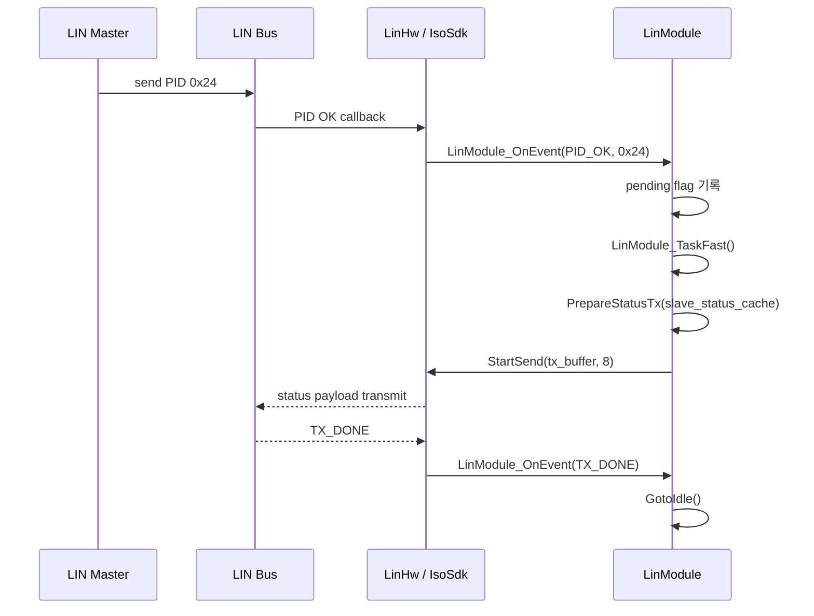

### 14.2 OK token 요청 흐름

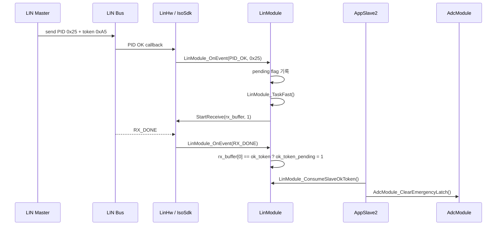

중요한 점은,
**token 수신과 latch 해제가 같은 층에서 바로 일어나지 않는다** 는 것이다.

- `LinModule` 은 token 수신 사실만 기록
- 실제 latch 해제 시도는 `AppSlave2_HandleLinOkToken()` 이 수행

즉, 통신 계층과 정책 계층을 분리해서 본 구조다.

---

## 15. fast task와 ISR/callback 분리

### 15.1 callback에서 하는 일

- event bit 기록
- current PID 기록
- 바로 반환

### 15.2 fast task에서 하는 일

- 기록된 event 소비
- PID에 따라 RX/TX 시작
- RX 완료 후 token 소비 표시
- TX 완료 후 idle 복귀
- error 처리

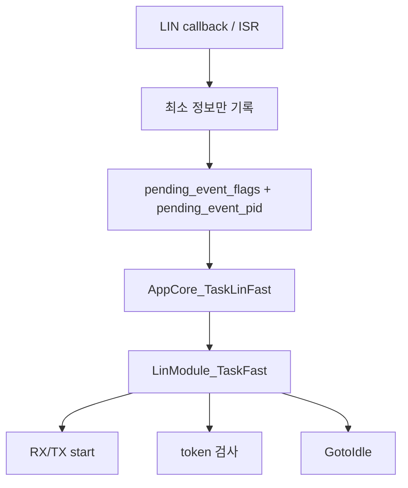

이 구조는 ISR 문맥과 일반 task 문맥을 나누어 보면 이해가 쉽다.

---

## 16. LED 구조 상세

`LedModule` 은 pattern 기반 LED 모듈이다.

지원 패턴은 대략 아래 역할을 가진다.

- `OFF`
- `GREEN_SOLID`
- `YELLOW_SOLID`
- `RED_SOLID`
- `RED_BLINK`
- `GREEN_BLINK`

### 16.1 현재 slave2 정책에서의 사용

`AppSlave2_UpdateLedPattern()` 기준:

- `emergency_latched != 0` → `RED_BLINK`
- `zone == SAFE` → `GREEN_SOLID`
- `zone == WARNING` → `YELLOW_SOLID`
- 그 외 (`DANGER`) → `RED_SOLID`

즉,
**latch 여부가 zone보다 우선** 이다.

### 16.2 LED 데이터 흐름

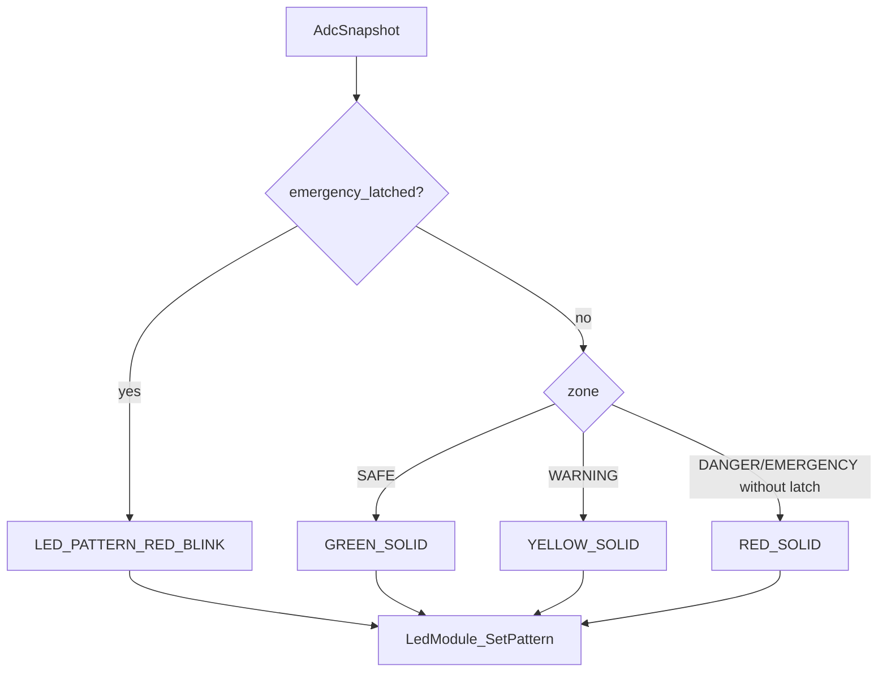

---

## 17. heartbeat와 내부 상태 문자열

이 slave 프로젝트는 UART 콘솔이 없지만,
상태 문자열은 내부에 유지한다.

- `adc_text`
- `lin_input_text`
- `lin_link_text`

초기값은 다음과 같다.

- `adc_text = "waiting"`
- `lin_input_text = "ready"`
- `lin_link_text = "waiting"`

그리고 상황에 따라 갱신된다.

### 17.1 예시

- ADC 샘플 없음 → `waiting`
- 샘플 오류 → `sample fault -> fail closed`
- 정상 샘플 → `1234 (warning, lock=1)`
- token으로 latch 해제 성공 → `ok token in`
- LIN init 성공 → `ready`
- LIN/ADC binding 실패 → `binding req`

이 문자열들은 현재 외부 UI에 직접 출력되지는 않지만,
디버깅용 내부 상태 표현으로 볼 수 있다.

---

## 18. 실제 핵심 호출 흐름

### 18.1 부팅 직후

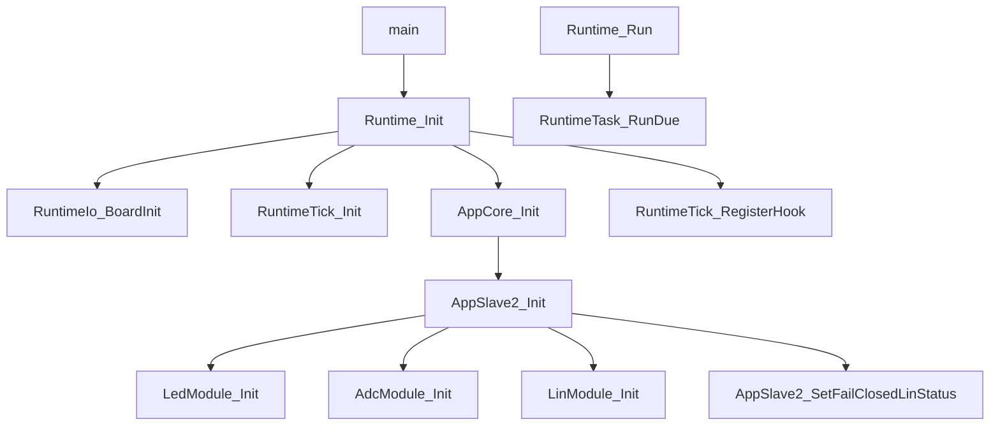

### 18.2 주기 동작

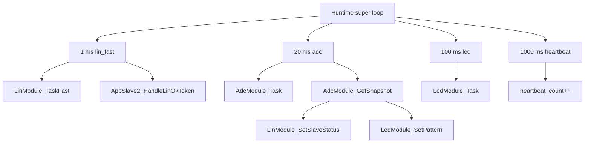

---

## 19. 파일별 핵심 책임

### 19.1 `main.c`

- `Runtime_Init()`
- `Runtime_Run()`

만 호출한다.

### 19.2 `runtime/runtime.c`

- board/tick/app 초기화
- tick hook 등록
- task table 구성
- super loop 실행

### 19.3 `runtime/runtime_io.c`

- local node id 제공
- ADC threshold 조립
- LIN PID / token / timeout 조립
- LIN HW callback bridge 연결
- board init + transceiver enable

### 19.4 `app/app_core.c`

- 기본 문자열 초기화
- slave2 init 연결
- 각 periodic task entry 구현
- tick ISR에서 LIN timeout service로 연결

### 19.5 `app/app_slave2.c`

- fail-closed LIN status 초기 설정
- ADC snapshot → 문자열 변환
- ADC snapshot → LIN status cache 반영
- ADC snapshot → LED pattern 반영
- OK token 소비 후 latch clear 시도

### 19.6 `services/adc_module.c`

- raw ADC sample
- zone classify
- fail-closed fault snapshot
- emergency latch set/clear
- sample state 관리

### 19.7 `services/lin_module.c`

- callback event 기록
- fast task에서 PID/RX/TX/error 처리
- status payload wire encode
- token RX 처리
- slave status cache 유지

### 19.8 `drivers/led_module.c`

- solid / blink pattern 반영
- task마다 blink phase 진행
- finite blink 지원

### 19.9 `drivers/adc_hw.c`

- `IsoSdk_AdcInit`
- `IsoSdk_AdcSample`

연결만 맡는다.

### 19.10 `drivers/lin_hw.c`

- IsoSdk event를 project event로 변환
- init / start_receive / start_send / goto_idle / set_timeout / service_tick
- 전역 singleton context 관리

---

## 20. 주의 포인트

### 20.1 `AppSlave2_Init()` 의 부분 실패 처리

LED / ADC / LIN 중 일부 init 실패가 나도,
함수 마지막은 기본적으로 `INFRA_STATUS_OK` 를 반환한다.

즉,

- ADC 실패해도 전체 AppCore init은 계속 갈 수 있고
- LIN 실패해도 runtime은 초기화 완료처럼 보일 수 있다.

bring-up 단계에서는 이 부분을 별도로 확인할 필요가 있다.

### 20.2 `fresh` 비트 의미

`LinModule_SetSlaveStatus()` 가 cache를 갱신할 때 `fresh = 1` 을 넣지만,
slave 쪽에서 이를 다시 0으로 내리는 경로는 없다.

즉 wire 상의 `fresh` 는 “새 샘플” 보다는 “현재 게시된 cache” 의미로 읽힐 수 있다.

### 20.3 `LedModule_Task()` 의 점멸 기준

현재 blink는 `now_ms` 를 쓰지 않고,
`led task` 가 호출될 때마다 phase를 뒤집는다.

따라서 점멸 속도는 `APP_TASK_LED_MS` 와 scheduler 호출 주기에 직접 묶여 있다.

### 20.4 LIN event 저장 방식

현재 구조는 아래 정보만 저장한다.

- `pending_event_flags`
- `pending_event_pid`

현재 slave 규모에서는 동작하지만,
이벤트 밀도가 높아지면 PID 문맥 손실 가능성을 따로 봐야 한다.

### 20.5 singleton 전제

- `s_lin_hw`
- `s_adc_hw_context`
- `s_iso_sdk_lin_context`

처럼 전역 단일 인스턴스 가정이 많다.
현재 프로젝트 규모에서는 단순하지만,
다채널/다인스턴스 확장 시에는 제약이 된다.

### 20.6 공용 프로젝트 잔재

이 slave 프로젝트는 비교적 슬림하지만,
공용 레이어 흔적 때문에 현재 핵심 흐름과 직접 무관한 파일도 일부 남아 있다.
예를 들면 `isosdk_can.*`, `isosdk_uart.*`, `infra_queue.*` 등은 이 프로젝트의 핵심 흐름 분석에서는 비중이 낮다.

---

## 21. 이 프로젝트를 이해할 때 중요한 포인트

### 21.1 이건 “ADC + LIN 응답 노드”다

스스로 뭔가를 요청하는 노드가 아니라,
현재 센서 상태를 유지하고 master 요청에 응답하는 쪽이다.

### 21.2 실제 상태의 원천은 `AdcModule` 이다

LIN은 상태를 실어 나르는 역할이고,
센서 의미 판단의 원천은 ADC module 쪽이다.

### 21.3 `AppSlave2` 가 정책 연결의 중심이다

ADC 결과를

- 문자열
- LIN status cache
- LED pattern

으로 연결하는 조립 역할을 한다.

### 21.4 token 수신과 latch 해제를 분리해서 봐야 한다

LIN token을 받았다고 바로 해제되지 않는다.
실제 해제는 현재 ADC zone까지 확인한 뒤에만 된다.

### 21.5 master 프로젝트와의 차이

slave는 스스로 header를 보내지 않는다.
그래서 `lin_poll` 대신 `lin_fast` 중심 구조가 된다.

---

## 22. 추천하는 읽는 순서

이 프로젝트를 처음 보는 사람이면 아래 순서로 보면 흐름이 잘 잡힌다.

1. `main.c`
2. `runtime/runtime.c`
3. `app/app_core_internal.h`
4. `app/app_core.c`
5. `app/app_slave2.c`
6. `services/adc_module.h`, `services/adc_module.c`
7. `services/lin_module.h`, `services/lin_module_internal.h`, `services/lin_module.c`
8. `runtime/runtime_io.c`
9. 마지막으로 `drivers/*`, `platform/s32k_sdk/*`

즉,
**정책 → 상태기계 → 하드웨어** 순서로 읽으면 전체 연결이 보인다.

---

## 23. 정리

이 프로젝트는 아래 흐름으로 읽을 수 있다.

- **얇은 main**
- **runtime 기반 cooperative scheduler**
- **AppCore 중심 조립 구조**
- **AppSlave2 중심 정책 연결**
- **AdcModule 중심 센서 해석과 latch 정책**
- **LinModule 중심 slave 상태기계**
- **LedModule 중심 로컬 시각화**

즉,
`ADC 샘플 → zone/latch 해석 → LIN status cache 반영 → master 요청 응답 → LED 표시`
흐름이 각 레이어에 나뉘어 배치된 구조다.

---

## 24. 한 장 요약 다이어그램

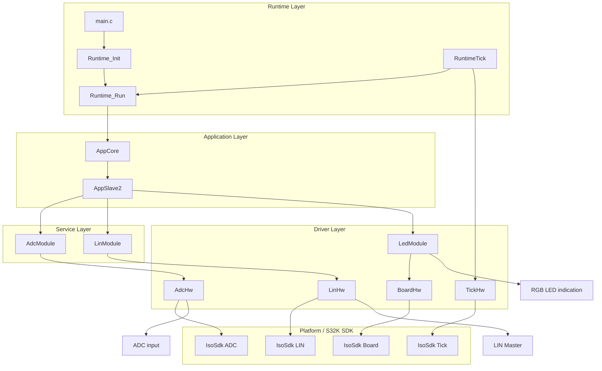
