# S32K_LinCanBle_master 구조/레이어/데이터 흐름 상세 분석

## 1. 프로젝트 개요

이 프로젝트는 **S32K 보드 위에서 동작하는 master coordinator 노드**이며,

- **Primary UART**로 사람과 상호작용하는 콘솔을 제공하고
- **Secondary UART(BLE bridge)** 로 간단한 원격 승인/상태 조회를 받고
- **CAN** 으로 `slave1`과 명령/응답/event/text를 주고받고
- **LIN master** 로 `slave2`의 상태를 polling 하며
- LIN 상태를 기준으로 **emergency 판단과 OK relay 정책**을 수행하는 구조다.

즉, 이 노드는 **입력 계층 + 정책 계층 + CAN/LIN 통신 계층**을 묶어서 동작시키는 coordinator 성격의 master 노드다.

## 2. 이 프로젝트를 한 문장으로 요약하면

이 프로젝트는 **사람 입력(UART/BLE), CAN 통신, LIN polling, 정책 상태기계**가 한 노드 안에서 함께 동작하는 master coordinator 구조다.

---

## 3. 최상위 구조 요약

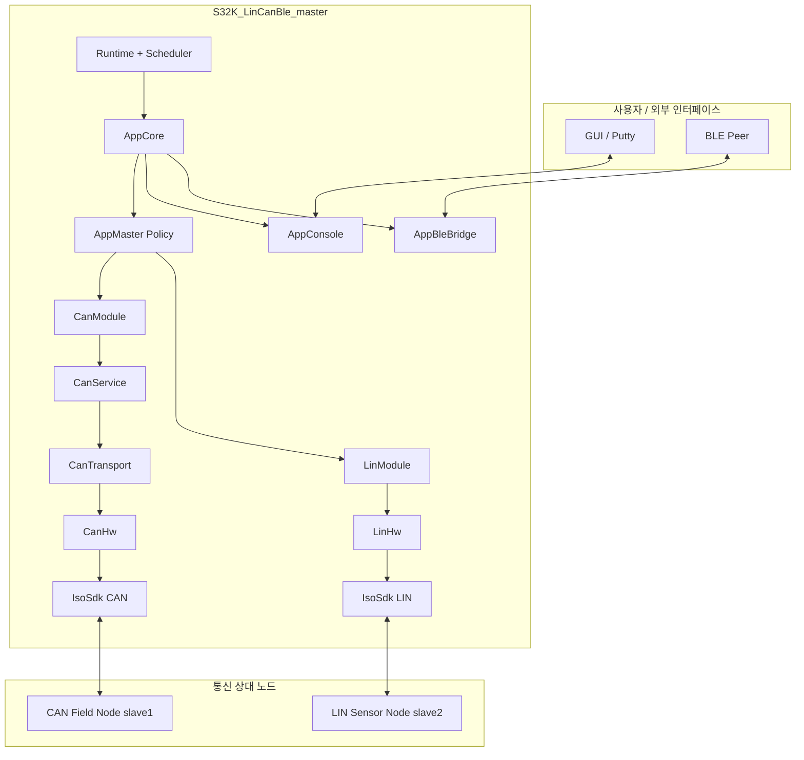

이 그림은 최상위에서 다음 4가지를 한 번에 보이게 하려는 요약이다.

- `Runtime + Scheduler -> AppCore -> AppMaster Policy` 중심축
- 사람 입력 경로: `Putty / BLE -> Console Input / BLE Input`
- CAN 경로: `CanModule -> CanService -> CanTransport -> CanHw -> IsoSdk CAN`
- LIN 경로: `LinModule -> LinHw -> IsoSdk LIN`

즉, 이 master 노드는 **입력 계층 + 정책 계층 + CAN/LIN 통신 계층**이 함께 묶인 coordinator 노드다.

## 4. 디렉터리 기준 구조

```text
main.c
app/
  app_ble_bridge.*        // BLE UART 보조 인터페이스
  app_config.h            // 노드 ID, task 주기, UI 크기, timeout 상수
  app_console.*           // UART 콘솔 UI + 명령 파싱 + 명령 queue
  app_core.*              // 앱 전체 조립점, task entry, UI state 보유
  app_master.*            // master 정책 로직, emergency/ok relay 판단
core/
  infra_queue.*           // 고정 크기 ring queue
  infra_types.h           // 공통 상태코드, wrap-safe 시간 유틸
  runtime_task.*          // cooperative periodic scheduler
  runtime_tick.*          // system tick + ISR hook
drivers/
  board_hw.*              // 보드 자원 adapter
  can_hw.*                // FlexCAN raw frame I/O wrapper
  led_module.*            // LED 모듈(현재 master 핵심 흐름에서는 비중 낮음)
  lin_hw.*                // LIN HW adapter
  tick_hw.*               // tick HW adapter
  uart_hw.*               // UART HW adapter
platform/s32k_sdk/
  isosdk_*                // NXP SDK / generated driver 연결층
runtime/
  runtime.*               // init + super loop
  runtime_io.*            // role-specific binding (master LIN config 등)
services/
  can_module.*            // app 친화적 CAN 요청 버퍼링 계층
  can_proto.*             // CAN wire encode/decode
  can_service.*           // pending request / timeout / incoming/result queue
  can_types.h             // CAN 공통 타입
  lin_module.*            // LIN 공용 상태기계
  uart_service.*          // line-based UART service
```

---

## 5. 레이어 관점에서 보면

이 프로젝트는 실제 물리 파일 수와 별개로, 논리적으로 아래와 같은 레이어 구조로 볼 수 있다.

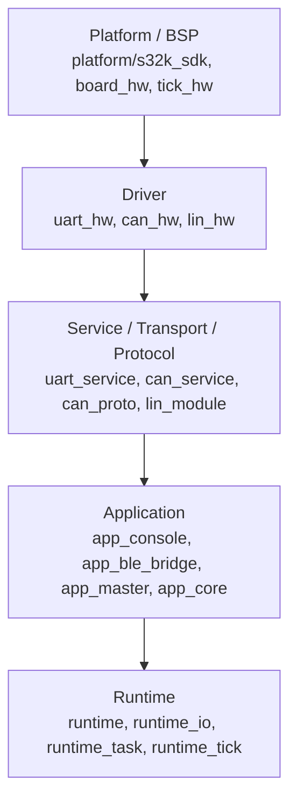

정확히는 `Runtime` 이 실행 프레임을 제공하고 `App` 을 돌리는 형태라서,
실행 흐름 관점에서는 아래와 같이 정리할 수 있다.

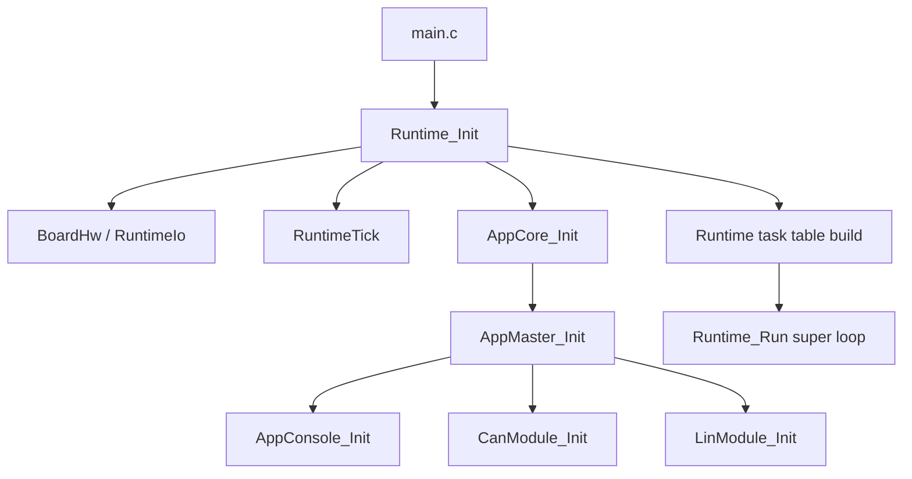

### 레이어별 책임

#### 5.1 `platform/s32k_sdk`
벤더 SDK / generated 코드와 직접 맞닿는 층이다.
`IsoSdk_*` 이름으로 감싸 두었기 때문에 상위 계층이 SDK 이름을 직접 몰라도 된다.

#### 5.2 `drivers`
하드웨어를 조금 더 일반화한 층이다.
예를 들어:

- `uart_hw` 는 RX callback/재수신 등록
- `can_hw` 는 mailbox 기반 frame TX/RX
- `lin_hw` 는 LIN init/header/send/receive/timeout bridging

을 담당한다.

#### 5.3 `services`
정책 직전의 “의미 있는 통신 계층”이다.

- `uart_service`: line 조립, TX chunk queue, recover
- `can_service`: request-response 추적, timeout, incoming/result queue
- `can_proto`: wire format encode/decode
- `lin_module`: master/slave 공용 LIN 상태기계

#### 5.4 `app`
사람/정책/표시/UI/도메인 로직이 있는 층이다.

- `app_console`: 사람이 입력하는 명령을 구조화된 command로 바꿈
- `app_ble_bridge`: BLE용 간단한 제어/상태 브리지
- `app_master`: emergency / ok relay 정책
- `app_core`: 전체 조립점 + task entry + UI text/state 보관

#### 5.5 `runtime/core`
전체 시스템이 돌아가는 시간 기반 프레임이다.

- `runtime_tick`: 시간 기준
- `runtime_task`: cooperative scheduler
- `runtime`: task table 구성 + super loop

---

## 6. 부팅 / 초기화 순서

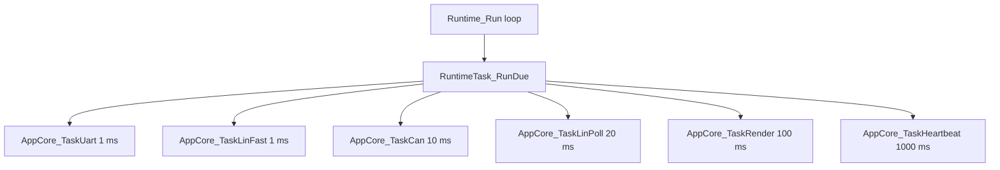

1. **보드/트랜시버** 를 먼저 올리고
2. **tick/timebase** 를 만들고
3. **AppCore** 를 초기화하면서 내부 통신 모듈들을 올린 뒤
4. **tick ISR hook** 으로 LIN timeout service 를 연결하고
5. 마지막에 **super loop** 로 들어간다.

특히 LIN timeout service를 tick hook에 등록하는 순서가 App 초기화 뒤에 와서,
미초기화 모듈에 ISR이 먼저 들어가는 상황을 피하고 있다.

---

## 7. 스케줄러 구조

`runtime/runtime.c` 에서 master용 task table이 고정 구성된다.

| 순서 | task | 주기 |
|---|---|---:|
| 0 | uart | 1 ms |
| 1 | lin_fast | 1 ms |
| 2 | can | 10 ms |
| 3 | lin_poll | 20 ms |
| 4 | render | 100 ms |
| 5 | heartbeat | 1000 ms |

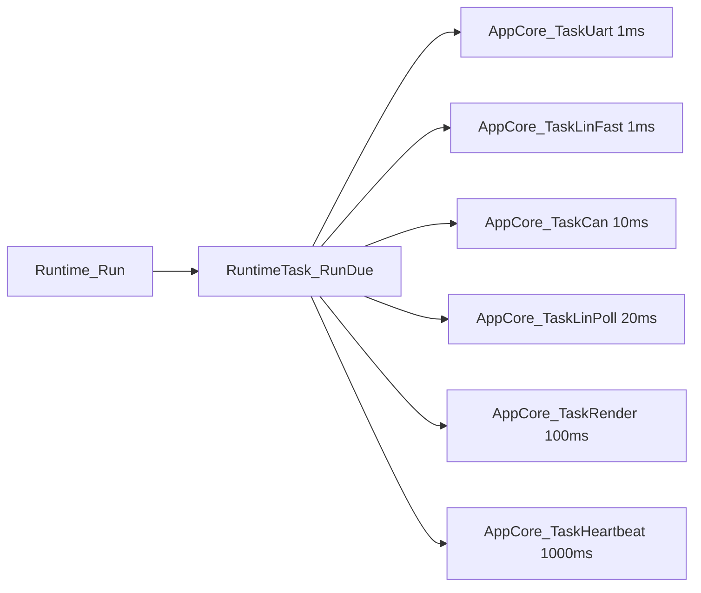

- `lin_poll` 은 **버스에 새 transaction을 시작하는 쪽**
- `lin_fast` 는 **callback에서 기록된 이벤트를 빠르게 처리하는 쪽**

이다.

즉,

- `20ms 마다 header를 보낸다` → `lin_poll`
- `그 결과 PID/RX/TX done/error 이벤트를 상태기계에 반영한다` → `lin_fast`

로 역할이 나뉘어 있다.

현재 구조에서는 `20ms poll에서 status 또는 ok 중 하나만 보낸다` 는 동작 특성이 있다.

---

## 8. AppCore가 실질적인 조립점이다

`AppCore` 가 이 프로젝트의 중앙 집합점이다.

### AppCore가 들고 있는 핵심 상태

- 모듈 enable 상태
  - `console_enabled`
  - `can_enabled`
  - `lin_enabled`
- 시스템 상태
  - `master_emergency_active`
  - `can_last_activity`
  - `heartbeat_count`
  - `uart_task_count`
  - `can_task_count`
- LIN 최근 상태 추적용 필드
  - `lin_last_reported_zone`
  - `lin_last_reported_lock`
  - `lin_last_reported_fault`
- OK relay 추적 상태
  - `ok_relay.state`
  - `ok_relay.retry_count`
  - `ok_relay.started_ms`
  - `ok_relay.last_retry_ms`
- 서브모듈 인스턴스
  - `AppBleBridge`
  - `AppConsole`
  - `CanModule`
  - `LinModule`
- UI view text
  - `mode_text`
  - `button_text`
  - `adc_text`
  - `can_input_text`
  - `lin_input_text`
  - `lin_link_text`

즉, `AppCore` 는 단순 controller가 아니라,
**상태 저장소 + 모듈 조립점 + task dispatcher + UI view-model** 역할을 동시에 한다.

---

## 9. UART 콘솔 흐름

### 9.1 콘솔의 역할

`AppConsole` 은 단순 printf 래퍼가 아니다.

1. UART 입력을 읽어 line 단위 명령으로 자르고
2. 명령을 파싱해서
3. 로컬 처리 또는 CAN command queue 적재를 수행하고
4. 화면용 view text 를 유지하며
5. 주기적으로 렌더링한다.

### 9.2 입력 명령 종류

주요 명령:

- `help`
- `hello`
- `ping`
- `status`
- `ok`
- `open <target>`
- `close <target>`
- `off <target>`
- `test <target>`
- `text <target> <msg...>`
- `event <target> <event> <arg0> <arg1>`

여기서 `ok` 는 **CAN으로 바로 나가지 않는 로컬 승인 입력** 이다.
`AppConsole_QueueLocalOk()` 로 저장되었다가,
`AppCore_TaskLinPoll()` 이 `AppConsole_ConsumeLocalOk()` 로 꺼내
`AppMaster_RequestOk()` 를 호출한다.

### 9.3 UART 입력 데이터 흐름

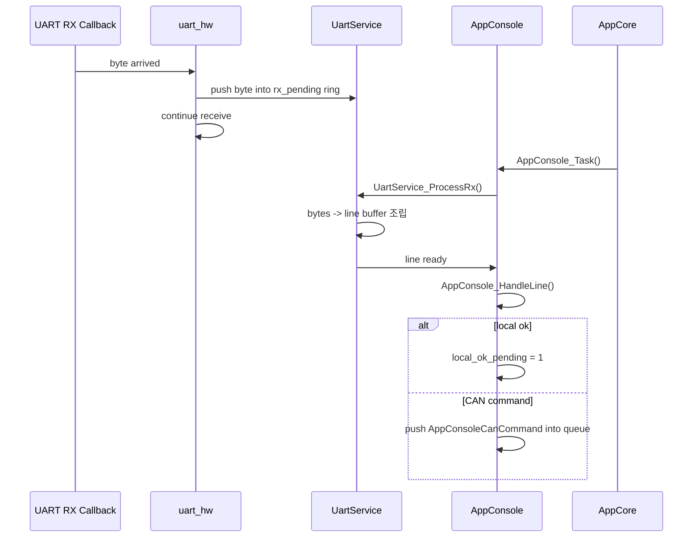

### 9.4 렌더 구조

현재 `APP_CONSOLE_OUTPUT_PROFILE` 은 `GUI` 로 설정되어 있다.
즉, 예전 ANSI cursor 기반 Putty 화면이 아니라,
**주기적으로 스냅샷 텍스트 블록을 만들어 UART로 보내는 형태** 다.

렌더 정보는 네 묶음이다.

- Connection Status (`task_text`)
- Status (`value_text`)
- Input (`source_text`)
- Message (`result_text`)

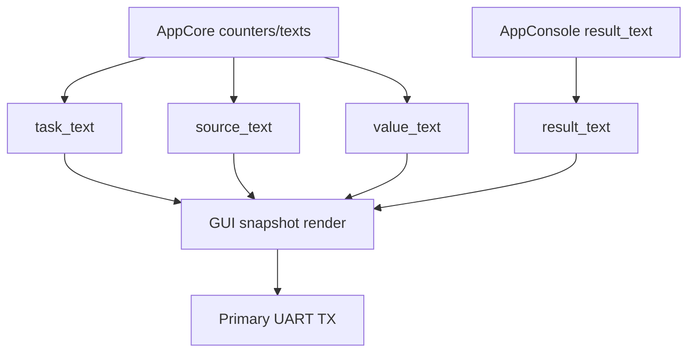

---

## 10. BLE bridge 흐름

`AppBleBridge` 는 **secondary UART** 를 사용하는 보조 제어 경로다.
주요 기능은 매우 제한적이다.

- `ok` → 로컬 승인 입력으로 연결
- `status` / `s` → 현재 상태 snapshot 일부 출력
- `help` / `h` → BLE 명령 도움말 출력
- 결과 메시지 변경 시 자동 sync

즉 BLE는 CAN/LIN 전체 프로토콜을 직접 다루는 경로가 아니라,
**원격에서 최소 기능만 사용할 수 있도록 둔 보조 인터페이스** 다.

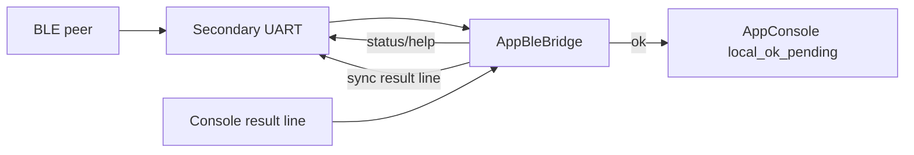

---

## 11. CAN 구조 상세

CAN 쪽은 아래 3단 구조로 정리할 수 있다.

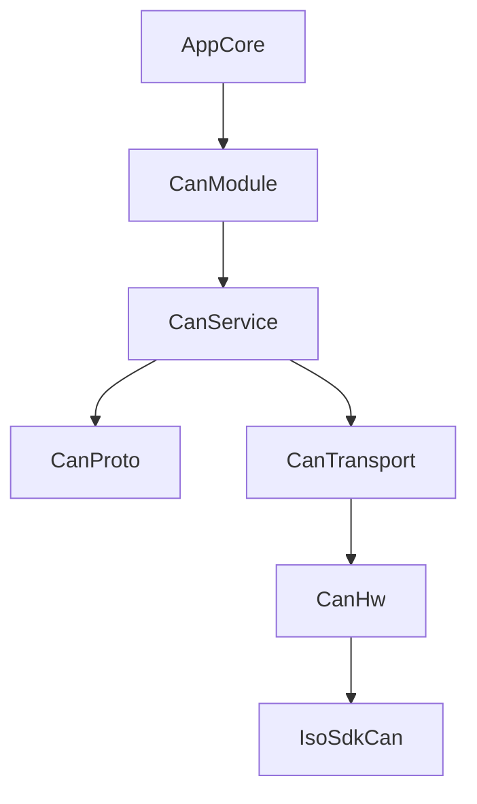

### 11.1 `CanModule`
앱 친화적인 큐잉 계층이다.

- App은 `QueueCommand/QueueResponse/QueueEvent/QueueText` 만 호출
- module은 request를 `request_queue` 에 저장
- 주기 task에서 조금씩 `CanService` 로 제출

즉, App이 transport 혼잡 상태를 직접 몰라도 된다.

### 11.2 `CanService`
중앙 처리 계층이다.

역할:

- request ID 발급
- pending table 관리
- response 매칭
- timeout 감지
- incoming queue / result queue 분리

### 11.3 `CanProto`
논리 메시지 ↔ raw frame 변환 담당.

- `COMMAND` → std ID `0x120`
- `RESPONSE` → `0x121`
- `EVENT` → `0x122`
- `TEXT` → `0x123`

비-text 메시지는 DLC 8의 단순 포맷,
text 메시지는 최대 11자 ASCII 기반의 별도 포맷이다.

### 11.4 `CanTransport`
software TX/RX queue + in-flight TX 관리 계층이다.

- TX queue 8
- RX queue 8
- 하드웨어 busy 여부 관찰
- 하드웨어 RX를 software RX로 흡수

### 11.5 `CanHw`
실제 mailbox 초기화와 callback bridge를 맡는다.

- RX mailbox done → frame queue 적재 → 재수신 시작
- TX mailbox done → tx_ok_count 증가

---

## 12. CAN 데이터 흐름

### 12.1 Console/BLE/Policy → CAN 송신

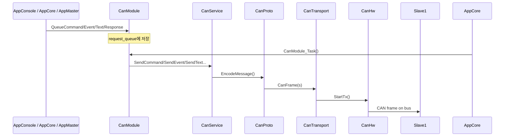

### 12.2 CAN 수신 → AppCore

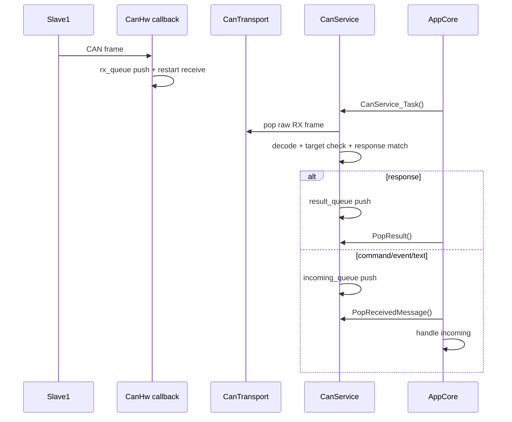

### 12.3 AppCore에서의 CAN 의미 처리

`AppCore_TaskCan()` 은 세 가지를 한 task에서 처리한다.

1. 콘솔이 넣은 CAN 명령 제출
2. 완료 결과(result) 소비
3. 수신 메시지(incoming) 소비

즉, AppCore 관점에서 CAN은
**“submit + result + incoming”** 의 3단 구조다.

---

## 13. LIN 구조 상세

LIN은 CAN보다 더 상태기계 중심으로 설계되어 있다.

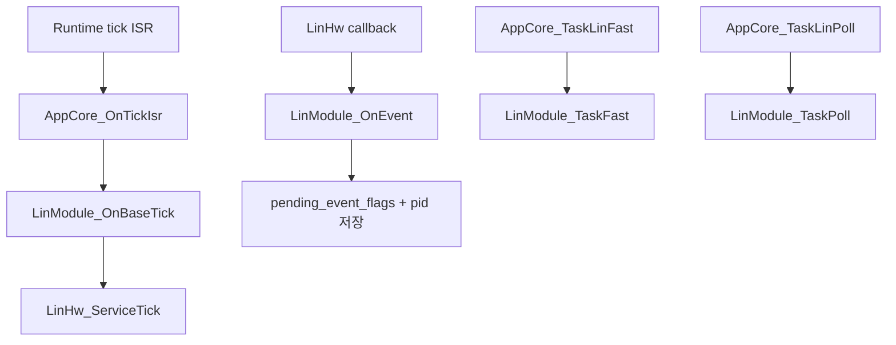

### 13.1 `LinModule` 의 핵심 상태

- 상태: `IDLE / WAIT_PID / WAIT_RX / WAIT_TX`
- 이벤트 입력: `PID_OK / RX_DONE / TX_DONE / ERROR`
- master poll 정보
  - `last_poll_ms`
  - `ok_tx_pending`
- 최신 상태 저장
  - `latest_status`
  - `latest_status_rx_ms`
- slave 전송용 cache
  - `slave_status_cache`
- slave가 받은 OK token 표시
  - `ok_token_pending`

### 13.2 master 모드 동작

master는 20ms마다 다음 중 하나를 시작한다.

1. `ok_tx_pending != 0` 이면 `pid_ok` header
2. 아니면 `pid_status` header

즉 **상태 조회와 OK token 전송이 동일한 poll 슬롯을 공유** 한다.

### 13.3 fast/poll 분리 의미

#### `LinModule_TaskPoll()`
- 새 header 송신 시작
- `status` poll 또는 `ok` poll 선택

#### `LinModule_TaskFast()`
- callback에서 기록한 event bit 소비
- PID 인식 후 RX/TX 시작
- RX 완료 시 status decode
- TX 완료 / error 처리

---

## 14. LIN 상태 데이터 흐름

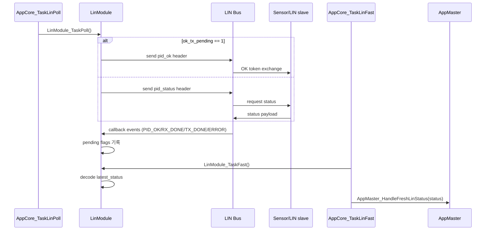

### LIN status frame 의미

`LinStatusFrame`:

- `adc_value`
- `zone`
- `emergency_latched`
- `valid`
- `fresh`
- `fault`

master는 이 값을 받아서

- UI 갱신
- emergency 여부 판정
- slave1에게 emergency 통지 여부 판단
- OK relay 승인 여부 판단

을 수행한다.

---

## 15. 이 프로젝트의 핵심 정책: OK relay 흐름

### 의미

- `slave1` 이 CAN으로 “OK 요청”을 보냄
- master가 현재 `slave2(LIN)` 상태를 확인
- emergency 영역을 벗어났지만 latch가 남아 있으면
  master가 LIN으로 `OK token` 을 보냄
- slave2의 latch 해제가 확인되면
  master가 다시 CAN으로 `slave1` 에게 OK를 전달

즉,
**CAN 승인 요청 → LIN latch 해제 요청 → LIN 상태 확인 → CAN 승인 전달**
의 relay 구조다.

### 상태도

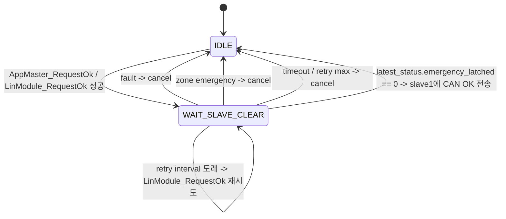

### 실제 호출 흐름

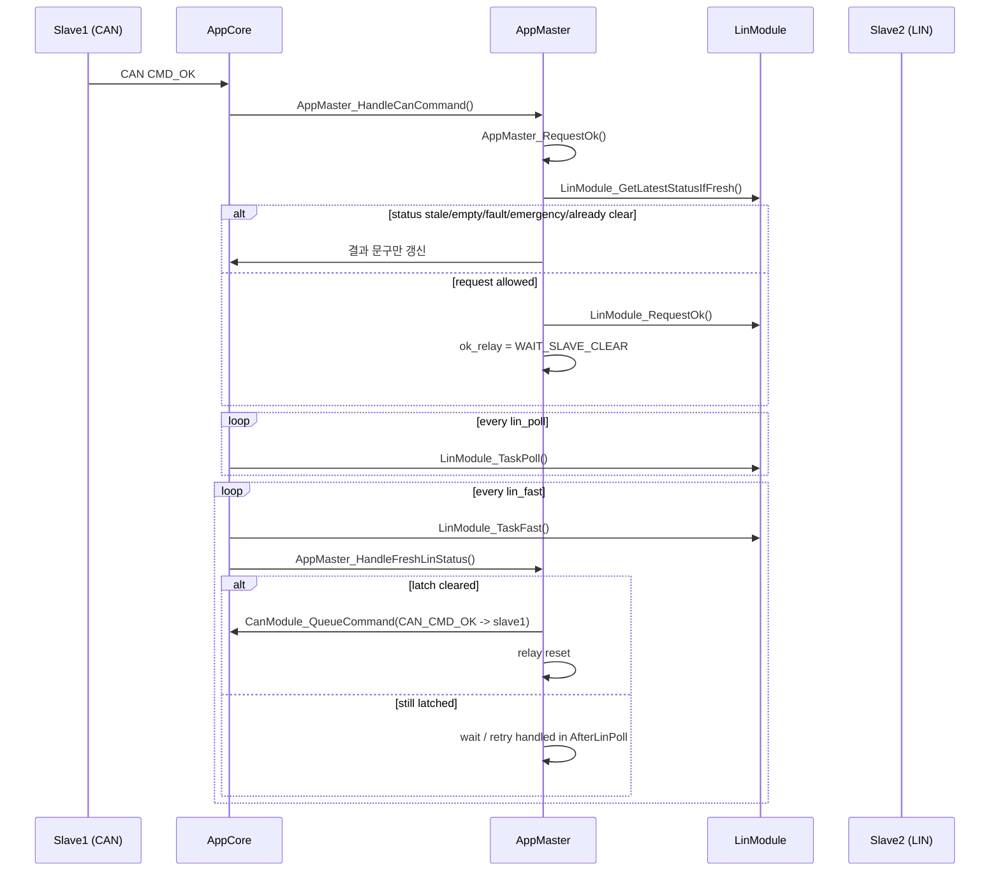

### `AppMaster_AfterLinPoll()` 의 역할

이 함수는 **“승인 대기 중인 relay 흐름의 감시자”** 다.

하는 일:

- 최신 LIN status 다시 확인
- 이미 latch가 풀렸는지 즉시 확인
- stale / timeout / retry max 조건 처리
- retry interval 도래 시 `LinModule_RequestOk()` 재시도

즉,
`AppMaster_HandleFreshLinStatus()` 가 **fresh status 기반 즉시 반응**, 
`AppMaster_AfterLinPoll()` 가 **주기 기반 보조 감시/재시도** 를 맡는다.

---

## 16. emergency 판단 흐름

master는 LIN status를 다음 기준으로 fail-closed 판단한다.

- `fault != 0`
- `zone == LIN_ZONE_EMERGENCY`
- `emergency_latched != 0`

즉,
**fault / emergency zone / latched 상태 중 하나만 있어도 master는 emergency_active로 본다.**

그리고 emergency_active 값이 이전과 달라지면:

1. `mode_text` 를 `fault` 또는 `emergency/normal` 로 갱신
2. 필요 시 진행 중인 ok relay 취소
3. `slave1` 에게 `CAN_CMD_EMERGENCY` 전송 시도

---

## 17. ISR / callback / task 문맥 분리

### 17.1 UART
- ISR/callback: 바이트를 pending ring에 넣고 다음 RX 등록
- task: line 조립, overflow 처리, 명령 파싱

### 17.2 CAN
- callback: RX frame queue 적재, TX 완료 카운터 갱신
- task: decode, response 매칭, timeout 처리

### 17.3 LIN
- callback: event bit + PID 기록
- fast task: PID/RX/TX/error 상태기계 처리
- poll task: 새 transaction 시작
- tick ISR hook: timeout service 한 step

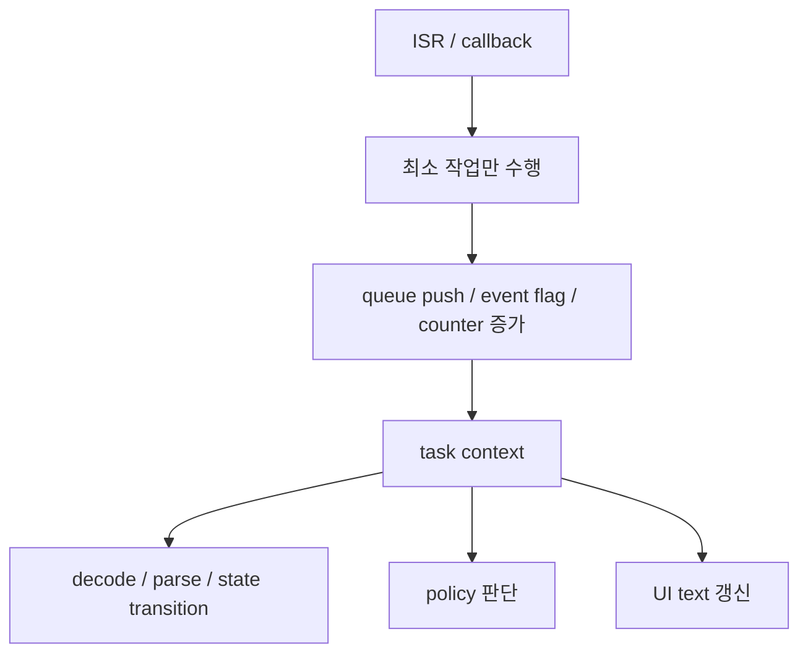

---

## 18. 주요 버퍼 / 큐 / 고정 용량 정리

| 모듈 | 구조 | 크기 |
|---|---|---:|
| UartService | RX pending ring | 32 bytes |
| UartService | RX line buffer | 64 chars |
| UartService | TX chunk size | 128 bytes |
| UartService | TX queue | 8 chunks |
| AppConsole | CAN command queue | 4 entries |
| CanModule | request queue | 8 entries |
| CanTransport | TX queue | 8 frames |
| CanTransport | RX queue | 8 frames |
| CanService | incoming queue | 8 messages |
| CanService | result queue | 8 results |
| CanService | pending table | 4 requests |
| LinModule | event storage | bit flags + PID 1 slot |
| RuntimeTick | ISR hooks | 4 slots |

---
## 19. 한 장 요약 다이어그램

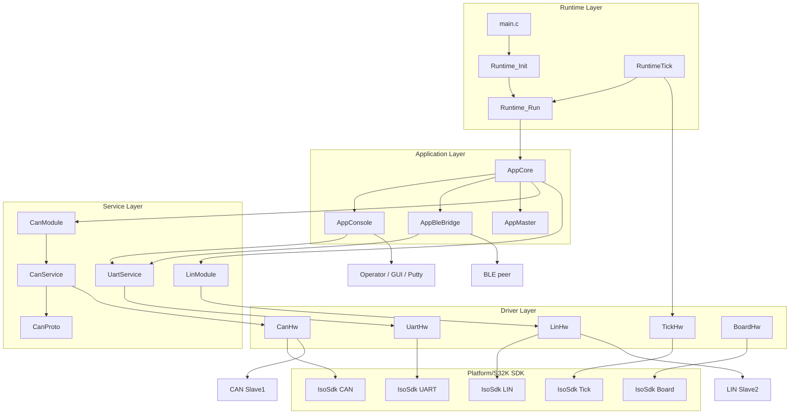
